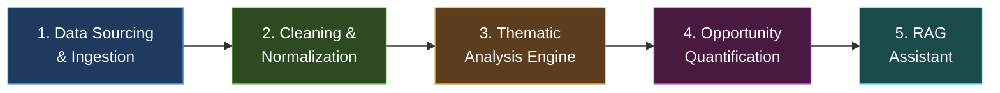
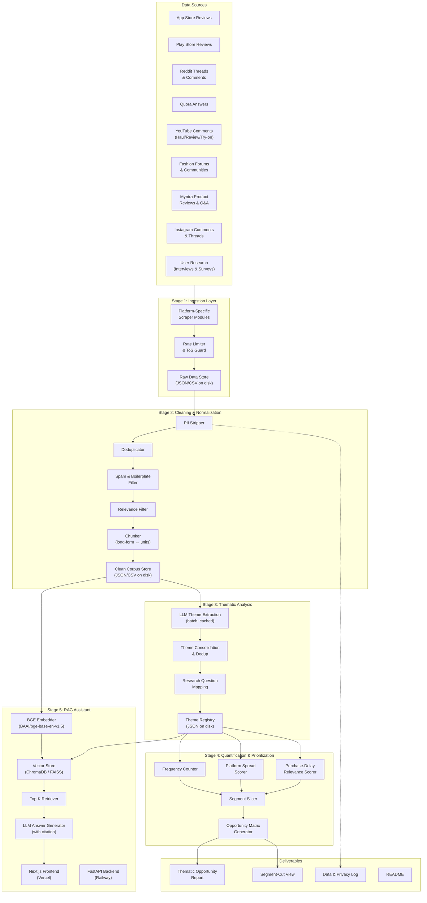
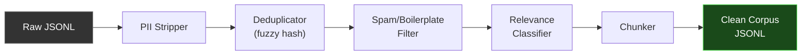
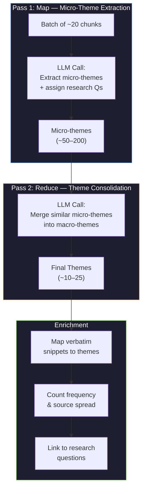
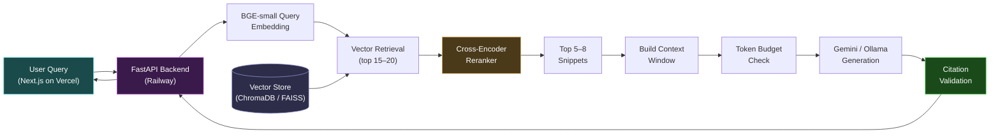
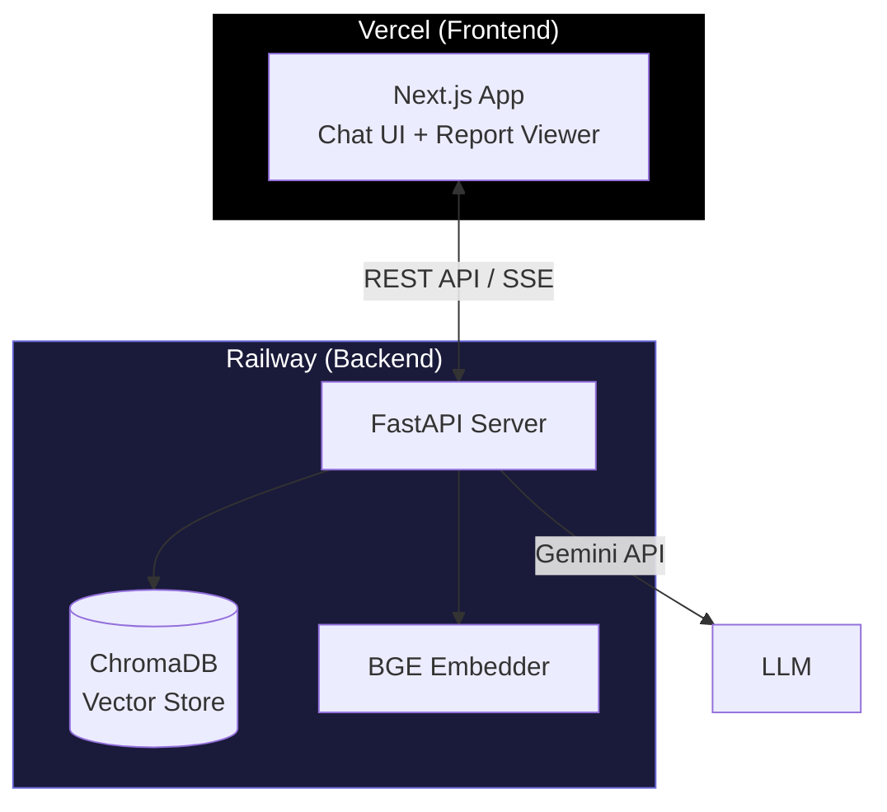
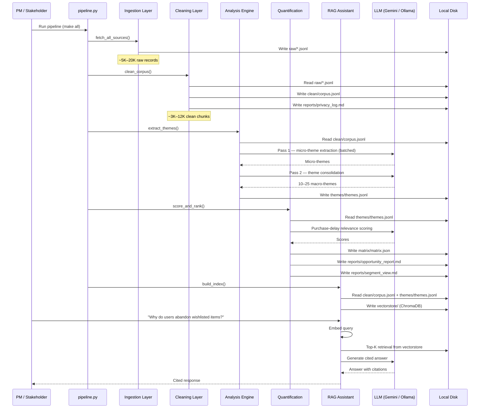
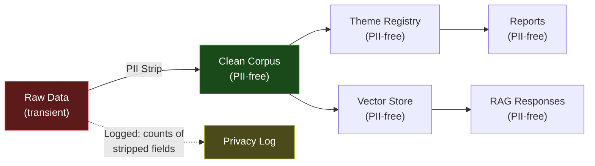

# Architecture: AI-Powered Wishlist-to-Purchase Discovery Engine

> **Source:** Derived from [context.md](file:///Users/daniamacbook/Desktop/NL%20Myntra/Docs/context.md)
> **Scope:** Discovery layer only — ingestion through RAG. Solution design is explicitly out of scope.

---

## 1. System Overview

The Discovery Engine is a five-stage, offline-first pipeline that converts scattered public conversations about fashion wishlisting into a ranked, evidence-backed opportunity map. It is designed to answer **ten research questions** posed by the Myntra Growth team, with every claim traceable to real user snippets.



### Design Principles

| Principle | Rationale |
|---|---|
| **Local-first, zero-cost** | All processing runs locally; LLMs via free-tier APIs or local Ollama; no paid proxies, hosting, or vector databases |
| **Token efficiency** | Summarize/compress before repeated LLM calls; cache intermediates; never re-process raw text |
| **PII-free pipeline** | Usernames, emails, device IDs stripped before storage — nothing identifying reaches any output |
| **Evidence traceability** | Every theme and RAG answer links back to ≥1 real, anonymized source snippet |
| **ToS-respecting collection** | Public sources only; no login-gated scraping; respect rate limits and robots.txt |

---

## 2. High-Level Architecture Diagram



---

## 3. Pipeline Stages — Detailed Design

### 3.1 Stage 1: Data Sourcing & Ingestion

**Purpose:** Collect raw public conversations and first-party research data about fashion wishlisting, shortlisting, and purchase decisions from multiple platforms and research channels.

#### 3.1.1 Source Modules

Each platform gets a dedicated scraper module. All scraped-source modules implement a shared interface. First-party research data (interviews & surveys) uses a file-based ingestion module.

```
Interface: SourceScraper
├── configure(query_terms, recency_window, max_results)
├── fetch() → List[RawRecord]
├── get_rate_limit_status() → RateLimitInfo
└── export(path) → void

Interface: ResearchIngester
├── load(file_path) → List[RawRecord]
├── validate_schema() → bool
└── export(path) → void
```

| Source | Method | Free-Tier Tool / Approach | Recency Window |
|---|---|---|---|
| **App Store Reviews** | Apify free-tier actor or `app-store-scraper` npm | Apify (free tier: 30 actor-seconds/month) | Last 6–12 months |
| **Play Store Reviews** | Apify free-tier actor or `google-play-scraper` | Apify / Python library | Last 6–12 months |
| **Reddit** | Apify Reddit scraper actors (free tier) | `trudax--reddit-scraper-lite`, `automation-lab--reddit-scraper` | Last 6–12 months |
| **Quora** | Apify Quora scraper actors (free tier) | `fatihtahta--quora-scraper`, `crawlerbros--quora-search-scraper` | Last 6–12 months |
| **YouTube Comments** | Apify YouTube scraper + YouTube Data API v3 (free tier) | `streamers--youtube-scraper`, YouTube Data API v3 (10,000 units/day free) | Last 6–12 months |
| **Instagram** | Apify Instagram scraper (free tier) | `apify--instagram-scraper` | Last 6–12 months |
| **Myntra Product Reviews** | Apify web scraper or custom scraper | Apify / `requests` + `bs4` (public product pages) | Last 6–12 months |
| **Fashion Forums** | Lightweight HTTP scraping + BeautifulSoup | Python `requests` + `bs4` | Last 6–12 months |
| **User Interviews** | File-based ingestion (JSON/CSV) | Manual transcripts pre-loaded to `data/research/interviews/` | N/A (existing data) |
| **User Surveys** | File-based ingestion (JSON/CSV) | Survey exports pre-loaded to `data/research/surveys/` | N/A (existing data) |

#### 3.1.2 Search Query Strategy

Queries are designed to surface wishlist/purchase-intent conversations:

```
Primary terms:
  "myntra wishlist", "myntra shortlist", "myntra cart abandon",
  "myntra not buying", "myntra save for later", "myntra hesitate",
  "online fashion wishlist", "fashion shopping cart",
  "ajio wishlist", "fashion app wishlist"

Extended terms (for Reddit/Quora):
  "why I don't buy from wishlist", "fashion purchase decision",
  "online shopping indecision", "saved items never bought",
  "wishlist vs actually buying", "fashion try before buy"
```

#### 3.1.3 Raw Data Schema

Every ingested record conforms to this schema before cleaning:

```json
{
  "record_id": "uuid-v4",
  "source_platform": "reddit | quora | appstore | playstore | youtube | instagram | forum | myntra_reviews | interview | survey",
  "source_url": "https://... (or null for research data)",
  "text": "raw text content",
  "timestamp": "ISO-8601",
  "ingestion_timestamp": "ISO-8601",
  "source_type": "scraped | first_party_research",
  "metadata": {
    "subreddit": "optional",
    "thread_title": "optional",
    "rating": "optional (for app/product reviews)",
    "video_title": "optional (for YouTube)",
    "product_category": "optional (for Myntra reviews)",
    "product_name": "optional (for Myntra reviews)",
    "interview_id": "optional (for interviews, anonymized)",
    "survey_question": "optional (for surveys)"
  }
}
```

> **PII rule:** No `username`, `author`, `email`, `device_id`, or `account_id` fields — ever. For user research data, interviewee identifiers must be anonymized (e.g., P01, P02) before ingestion.

#### 3.1.4 Rate Limiting & ToS Guard

- Per-platform configurable rate limits (requests/minute, requests/day)
- Exponential backoff on HTTP 429 / 503
- robots.txt check before forum scraping
- All Apify calls route through the free-tier quota tracker

#### 3.1.5 Storage

- **Format:** JSONL files, one per platform per run (`raw/reddit_2026-08.jsonl`, `raw/myntra_reviews_2026-08.jsonl`, `raw/interviews.jsonl`, `raw/surveys.jsonl`)
- **Location:** Local disk — no cloud storage
- **Estimated volume:** 8,000–30,000 raw records across all sources (including research data)

---

### 3.2 Stage 2: Cleaning & Normalization

**Purpose:** Transform raw records into a de-identified, deduplicated, relevance-filtered corpus ready for LLM analysis.

#### 3.2.1 Processing Pipeline



| Step | Technique | Details |
|---|---|---|
| **PII Stripping** | Regex + spaCy NER | Remove `@handles`, emails, phone numbers, names detected by NER. Log what was stripped (counts only, not content) for the privacy log. |
| **Deduplication** | MinHash / SimHash | Near-duplicate detection at 85% similarity threshold. Cross-platform dedup to avoid counting the same copypasted review twice. |
| **Spam / Boilerplate** | Rule-based + heuristic | Remove reviews < 10 words, repetitive "5 stars great app" boilerplate, promotional content, non-English text (unless Hindi/Hinglish — retain for Indian fashion context). |
| **Relevance Filter** | Keyword + lightweight LLM classifier | Keep only records that discuss wishlisting, purchase decisions, fashion shopping friction, comparison behavior, or fit/size/price concerns. Discard pure delivery/logistics complaints unless they connect to purchase hesitation. |
| **Chunking** | Sliding window, semantic boundaries | Reddit threads: split into individual comment-level chunks. YouTube: split comment sections by comment. Long reviews: split at ~300 tokens with 50-token overlap. Each chunk retains its parent `record_id`. |

#### 3.2.2 Clean Corpus Schema

```json
{
  "chunk_id": "uuid-v4",
  "parent_record_id": "uuid-v4",
  "source_platform": "reddit",
  "text": "cleaned, PII-free text",
  "word_count": 87,
  "timestamp": "ISO-8601",
  "relevance_tags": ["wishlist_intent", "price_comparison"],
  "language": "en"
}
```

#### 3.2.3 Storage

- **Format:** JSONL (`clean/corpus.jsonl`)
- **Expected volume after cleaning:** 3,000–12,000 chunks
- **Privacy log:** Auto-generated counts of PII fields stripped, records filtered, and reasons

---

### 3.3 Stage 3: Thematic Analysis Engine

**Purpose:** Use an LLM to extract emergent themes from the corpus, mapping each to the 10 research questions, with verbatim evidence.

#### 3.3.1 Two-Pass Architecture

The analysis uses a **map-reduce** approach to stay within free-tier token limits:



**Pass 1 — Micro-Theme Extraction (Map):**
- Batch chunks into groups of ~20 (to fit within context window)
- For each batch, prompt the LLM to extract micro-themes, assign relevant research question IDs (RQ1–RQ10), and select the most representative verbatim quote per theme
- Cache each batch result to avoid re-processing

**Pass 2 — Theme Consolidation (Reduce):**
- Feed all micro-themes to the LLM in a single consolidation prompt
- Merge semantically overlapping micro-themes into macro-themes (target: 10–25 final themes)
- Produce a canonical name, description, and merged evidence list for each

#### 3.3.2 Theme Schema

```json
{
  "theme_id": "T-001",
  "name": "Size & Fit Uncertainty",
  "description": "Users hesitate to purchase because...",
  "research_questions": ["RQ3", "RQ7"],
  "evidence": [
    {
      "chunk_id": "uuid",
      "snippet": "I really wanted to buy the dress but...",
      "source_platform": "reddit"
    }
  ],
  "micro_theme_ids": ["MT-003", "MT-017", "MT-042"],
  "chunk_count": 187,
  "source_platforms": ["reddit", "appstore", "youtube"],
  "platform_distribution": {
    "reddit": 92,
    "appstore": 54,
    "youtube": 41
  }
}
```

#### 3.3.3 Token Efficiency Strategy

| Technique | Saving |
|---|---|
| Batch chunking (20 chunks/call) | Reduces API calls by ~95% vs. per-chunk |
| Intermediate caching (JSONL on disk) | Zero re-processing on re-runs |
| Compression prompt ("extract themes only, no preamble") | ~30% token reduction per response |
| Two-pass map-reduce vs. single mega-prompt | Stays within free-tier context limits |

---

### 3.4 Stage 4: Opportunity Quantification & Prioritization

**Purpose:** Score and rank themes into a stakeholder-ready opportunity matrix.

#### 3.4.1 Scoring Dimensions

Each theme is scored on three axes:

| Dimension | Signal | Calculation |
|---|---|---|
| **Frequency** | How often this friction appears | `chunk_count / total_corpus_chunks` normalized to 0–100 |
| **Platform Spread** | Cross-platform corroboration | `unique_platforms / total_platforms` normalized to 0–100 |
| **Purchase-Delay Relevance** | How directly it maps to abandonment/postponement | LLM-scored 0–100 (prompt: "How directly does this theme explain why a user would NOT convert a wishlisted item?") |

**Composite Opportunity Score:**

```
opportunity_score = (0.4 × frequency) + (0.3 × platform_spread) + (0.3 × purchase_delay_relevance)
```

#### 3.4.2 Opportunity Matrix Schema

```json
{
  "theme_id": "T-001",
  "name": "Size & Fit Uncertainty",
  "frequency_score": 78,
  "platform_spread_score": 83,
  "purchase_delay_score": 91,
  "opportunity_score": 83.5,
  "rank": 1,
  "research_questions": ["RQ3", "RQ7"],
  "segment_cuts": {
    "category": { "women_western": 62, "men_casual": 18 },
    "price_band": { "under_1000": 34, "1000_3000": 41, "above_3000": 25 },
    "occasion": { "everyday": 55, "occasion_specific": 45 }
  }
}
```

#### 3.4.3 Segment Slicing

Where corpus volume allows, themes are broken out by inferred segments:

- **Product category** — extracted from mentions (e.g., "kurta", "sneakers", "dress")
- **Price band** — parsed from price mentions (₹ amounts, "expensive", "budget")
- **Occasion vs. everyday** — classified by context cues ("wedding", "office", "daily wear")
- **User type** — first-time vs. repeat buyer signals ("never ordered from Myntra" vs. "I always wishlist first")

> **Minimum sample-size rule:** Segment inference is best-effort from text. A segment is only reported if it has **≥10 supporting chunks**. Segments below this threshold are flagged as `low_confidence` and excluded from the main report to avoid spurious conclusions from thin data.

---

### 3.5 Stage 5: Lightweight RAG Assistant

**Purpose:** Let stakeholders ask free-form questions against the corpus and theme summaries, with every answer grounded in and cited back to source snippets.

#### 3.5.1 Architecture



#### 3.5.2 Deployment Architecture



| Component | Platform | URL Pattern | Free Tier |
|---|---|---|---|
| **Frontend** | Vercel | `https://myntra-discovery.vercel.app` | ✅ Hobby plan (free) |
| **Backend** | Railway | `https://myntra-discovery-api.up.railway.app` | ✅ Trial plan ($5 credit/month) |

#### 3.5.3 Index Construction

Two collections in the vector store:

| Collection | Contents | Chunk Size | Count |
|---|---|---|---|
| `corpus_chunks` | Cleaned user conversation chunks (scraped + research) | ~300 tokens | 5,000–20,000 |
| `theme_summaries` | Theme descriptions + top evidence snippets | ~500 tokens | 10–25 |

#### 3.5.4 Embedding Model

- **Model:** `BAAI/bge-small-en-v1.5` (via `sentence-transformers`) — free, open-source, local, no API cost
- **Dimension:** 384
- **Runs on:** CPU (no GPU required)
- **Why BGE-small:** Best trade-off of retrieval accuracy vs. memory/speed for a local-first, free-tier setup. Outperforms MiniLM on MTEB benchmarks while remaining lightweight enough for Railway's free tier. Instruction-aware embeddings improve domain-specific queries.
- **Configurable:** Model name, query instruction prefix, and batch size are all configurable via `backend/src/rag/rag_config.py`

#### 3.5.5 Reranker

- **Model:** `cross-encoder/ms-marco-MiniLM-L-6-v2` (via `sentence-transformers`) — free, local, no API cost
- **Purpose:** Re-score the top 15–20 BGE candidates using a cross-encoder for higher precision before sending to the LLM
- **Runs on:** CPU
- **Configurable:** Reranker model, candidate pool size, and final top-K are all configurable

#### 3.5.6 Retrieval & Generation Pipeline

The full RAG flow per query:

```
Query
  → BGE-small embedding (with instruction prefix)
  → Vector retrieval: top 15–20 candidates from both collections
  → Cross-encoder rerank: score all candidates with ms-marco-MiniLM
  → Select top 5–8 by reranker score
  → Build context window (with token budget check)
  → Gemini / Ollama generation (with token estimation + rate limiting)
  → Citation validation (every claim must have [Source: ...] tag)
  → Return cited answer
```

| Parameter | Value | Configurable | Rationale |
|---|---|---|---|
| **Initial retrieval K** | 15–20 | ✅ `rag_config.py` | Wide net for recall before reranking |
| **Final top-K (post-rerank)** | 5–8 | ✅ `rag_config.py` | Precision-focused context for LLM |
| **Retrieval scope** | Both collections | ✅ | Corpus for raw evidence, themes for synthesized context |
| **Reranker model** | `cross-encoder/ms-marco-MiniLM-L-6-v2` | ✅ `rag_config.py` | Free, local, strong reranking accuracy |
| **LLM generation** | Gemini free tier / Ollama (local) | ✅ `.env` | System prompt enforces citation format |
| **Citation format** | `[Source: Reddit, chunk_id: abc123]` | — | Every claim links to a retrievable snippet |
| **Citation validation** | Post-generation check: every factual sentence must have ≥1 `[Source:]` tag; responses without citations are rejected and retried once | — | Prevents unsupported claims |
| **Hallucination guard** | System prompt: "Only answer from retrieved context. If insufficient evidence, say so." | — | Prevents unsupported claims |

#### 3.5.7 LLM Call Protocol

Before **every** Gemini API call (in both analysis and RAG generation):

```
1. Estimate input tokens (tiktoken / char-based approximation)
2. Check requests-per-minute budget (Gemini free tier: 15 RPM)
3. Check daily request budget (Gemini free tier: 1,500 RPD)
4. If budget exceeded → queue or fall back to Ollama
5. On HTTP 429 → exponential backoff (1s, 2s, 4s, 8s, max 60s)
6. Cache result keyed by hash(prompt + system_prompt)
7. On cache hit → skip API call entirely
8. Retry only on transient errors (429, 503), NOT on 400/invalid
```

This protocol is enforced by `src/utils/llm_client.py` — no module calls Gemini directly.

#### 3.5.8 Retrieval Evaluation

A benchmark suite of **20–30 test queries** (covering English, Hindi, and Hinglish) is used to evaluate retrieval quality before and after reranking:

| Metric | Target | Measured Against |
|---|---|---|
| **Recall@5** | ≥0.70 | Pre-labeled relevant chunks for each query |
| **Recall@10** | ≥0.85 | Pre-labeled relevant chunks for each query |
| **MRR (Mean Reciprocal Rank)** | ≥0.60 | First relevant chunk position |
| **Reranker lift** | ≥10% Recall@5 improvement over BGE-only | Before/after reranking comparison |

**Benchmark query categories:**
- 10 English queries (direct RQ-mapped)
- 5 Hindi queries (e.g., "myntra pe wishlist mein kyun rakhte ho?")
- 5 Hinglish queries (e.g., "why myntra ki wishlist se kuch nahi khareedta")
- 5–10 edge cases (out-of-scope, ambiguous, multi-theme)

Results are saved to `data/eval/retrieval_benchmark.json` and logged to `reports/retrieval_eval.md`.

#### 3.5.9 Frontend (Next.js on Vercel)

| Feature | Details |
|---|---|
| **Chat interface** | Real-time Q&A with streaming responses (SSE) |
| **Report viewer** | Renders `opportunity_report.md` and `segment_view.md` as interactive pages |
| **Source explorer** | Click on citations to view full source snippets |
| **Example queries** | Pre-loaded question suggestions for quick start |
| **Responsive design** | Mobile-friendly for stakeholder access |

#### 3.5.10 Backend (FastAPI on Railway)

| Endpoint | Method | Purpose |
|---|---|---|
| `/api/query` | POST | Accept user query, run retrieve → rerank → generate → validate pipeline |
| `/api/themes` | GET | Return all themes with scores and evidence |
| `/api/matrix` | GET | Return opportunity matrix data |
| `/api/report` | GET | Return the full opportunity report |
| `/api/health` | GET | Health check + LLM quota status |

---

## 4. Technology Stack

All tools are free-tier or open-source. Deployment uses Vercel (frontend) and Railway (backend) free tiers.

| Layer | Technology | Cost |
|---|---|---|
| **Backend Language** | Python 3.10+ | Free |
| **Frontend Language** | TypeScript / Next.js | Free |
| **Scraping / Ingestion** | Apify free tier (actors), `requests`, `BeautifulSoup` | Free (within quotas) |
| **YouTube Data API v3** | `google-api-python-client` | Free (10,000 units/day) |
| **User Research Ingestion** | File-based loader (JSON/CSV) | Free |
| **Myntra Reviews** | Apify / custom scraper | Free (within quotas) |
| **PII Detection** | Regex + spaCy (`en_core_web_sm`) | Free |
| **Deduplication** | `datasketch` (MinHash) | Free |
| **LLM — Analysis** | Google Gemini API (free tier) / Ollama (local fallback) | Free |
| **LLM — RAG Generation** | Google Gemini API (free tier) / Ollama (local fallback) | Free |
| **Embeddings** | `BAAI/bge-small-en-v1.5` (via `sentence-transformers`) | Free, local |
| **Reranker** | `cross-encoder/ms-marco-MiniLM-L-6-v2` (via `sentence-transformers`) | Free, local |
| **Vector Store** | ChromaDB (local / Railway) or FAISS | Free |
| **Frontend Hosting** | Vercel (Hobby plan) | Free |
| **Backend Hosting** | Railway (Trial plan) | Free ($5 credit/month) |
| **Backend Framework** | FastAPI | Free |
| **Data Storage** | Local JSONL files on disk / Railway volume | Free |
| **Orchestration** | Python scripts / Makefile | Free |
| **Reporting** | Markdown / Next.js rendered pages | Free |

---

## 5. Project Directory Structure

```
NL Myntra/
├── Docs/
│   ├── context.md                  # Problem statement & scope
│   ├── context.txt                 # Problem statement (plain text)
│   ├── architecture.md             # This document
│   └── implementation-plan.md      # Phase-wise implementation plan
│
├── backend/                        # Python — deployed to Railway
│   ├── src/
│   │   ├── ingestion/
│   │   │   ├── __init__.py
│   │   │   ├── base_scraper.py        # Abstract scraper interface
│   │   │   ├── reddit_scraper.py      # Reddit via Apify
│   │   │   ├── quora_scraper.py       # Quora via Apify
│   │   │   ├── appstore_scraper.py    # App Store reviews
│   │   │   ├── playstore_scraper.py   # Play Store reviews
│   │   │   ├── youtube_scraper.py     # YouTube comments via Apify + Data API v3
│   │   │   ├── instagram_scraper.py   # Instagram comments & threads via Apify
│   │   │   ├── myntra_scraper.py      # Myntra product reviews
│   │   │   ├── forum_scraper.py       # Fashion forums (HTTP + BS4)
│   │   │   ├── research_ingester.py   # User interviews & surveys (file-based)
│   │   │   └── config.py              # Query terms, rate limits, recency window
│   │   │
│   │   ├── cleaning/
│   │   │   ├── __init__.py
│   │   │   ├── pii_stripper.py        # Regex + spaCy NER PII removal
│   │   │   ├── deduplicator.py        # MinHash near-duplicate detection
│   │   │   ├── spam_filter.py         # Boilerplate & spam removal
│   │   │   ├── relevance_filter.py    # Keyword + LLM relevance classifier
│   │   │   └── chunker.py             # Long-form → analyzable units
│   │   │
│   │   ├── analysis/
│   │   │   ├── __init__.py
│   │   │   ├── theme_extractor.py     # Pass 1: micro-theme extraction
│   │   │   ├── theme_consolidator.py  # Pass 2: merge into macro-themes
│   │   │   ├── research_mapper.py     # Map themes → RQ1–RQ10
│   │   │   └── prompts.py             # All LLM prompt templates
│   │   │
│   │   ├── quantification/
│   │   │   ├── __init__.py
│   │   │   ├── scorer.py              # Frequency, spread, relevance scoring
│   │   │   ├── segment_slicer.py      # Category, price, occasion segmentation
│   │   │   └── matrix_generator.py    # Opportunity matrix output
│   │   │
│   │   ├── rag/
│   │   │   ├── __init__.py
│   │   │   ├── rag_config.py          # Configurable retrieval/embedding settings
│   │   │   ├── embedder.py            # BGE-small embedding (bge-small-en-v1.5)
│   │   │   ├── reranker.py            # Cross-encoder reranker
│   │   │   ├── vector_store.py        # ChromaDB / FAISS wrapper
│   │   │   ├── retriever.py           # Retrieve → rerank → top-K pipeline
│   │   │   ├── generator.py           # LLM answer generation with citation validation
│   │   │   └── evaluator.py           # Retrieval benchmark (Recall@K, MRR)
│   │   │
│   │   └── utils/
│   │       ├── __init__.py
│   │       ├── config.py              # Centralized config & env loader
│   │       ├── cache.py               # Intermediate result caching
│   │       ├── rate_limiter.py        # Per-platform rate limiting
│   │       ├── llm_client.py          # Unified LLM interface (Gemini/Ollama)
│   │       └── logger.py              # Structured logging
│   │
│   ├── api/
│   │   ├── __init__.py
│   │   ├── main.py                    # FastAPI app entry point
│   │   ├── routes/
│   │   │   ├── query.py               # POST /api/query — RAG Q&A
│   │   │   ├── themes.py              # GET /api/themes — theme data
│   │   │   ├── matrix.py              # GET /api/matrix — opportunity matrix
│   │   │   └── report.py              # GET /api/report — full report
│   │   └── middleware/
│   │       └── cors.py                # CORS config for Vercel frontend
│   │
│   ├── data/
│   │   ├── raw/                       # Raw JSONL per platform per run
│   │   ├── clean/                     # Cleaned corpus (corpus.jsonl)
│   │   ├── themes/                    # Theme registry (themes.jsonl)
│   │   ├── matrix/                    # Opportunity matrix (matrix.json)
│   │   ├── research/                  # First-party research data
│   │   │   ├── interviews/            # Interview transcripts (anonymized)
│   │   │   └── surveys/               # Survey response exports
│   │   └── vectorstore/               # ChromaDB / FAISS index files
│   │
│   ├── reports/
│   │   ├── opportunity_report.md      # Thematic opportunity report
│   │   ├── segment_view.md            # Segment-cut breakdowns
│   │   └── privacy_log.md             # Data exclusion & anonymization log
│   │
│   ├── pipeline.py                    # Main orchestrator — runs all stages
│   ├── requirements.txt               # Python dependencies
│   ├── Procfile                       # Railway entry point
│   ├── railway.toml                   # Railway config
│   └── Makefile                       # Convenience targets
│
├── frontend/                          # Next.js — deployed to Vercel
│   ├── src/
│   │   ├── app/
│   │   │   ├── page.tsx               # Landing / chat page
│   │   │   ├── report/page.tsx        # Opportunity report viewer
│   │   │   ├── matrix/page.tsx        # Opportunity matrix visualization
│   │   │   └── layout.tsx             # Root layout
│   │   ├── components/
│   │   │   ├── ChatInterface.tsx       # RAG Q&A chat component
│   │   │   ├── CitationCard.tsx        # Source citation display
│   │   │   ├── ThemeCard.tsx           # Theme summary card
│   │   │   └── MatrixChart.tsx         # Opportunity matrix chart
│   │   └── lib/
│   │       └── api.ts                 # Backend API client
│   ├── package.json
│   ├── next.config.js
│   ├── vercel.json                    # Vercel config
│   └── tsconfig.json
│
└── README.md                          # Setup, usage, architecture overview
```

---

## 6. Data Flow — End to End



---

## 7. LLM Usage & Token Budget

### 7.1 Token Estimation

| Stage | Calls | Input Tokens/Call | Output Tokens/Call | Total Tokens |
|---|---|---|---|---|
| **Theme Extraction (Pass 1)** | ~250 batches (5K chunks ÷ 20) | ~6,000 | ~1,500 | ~1,875,000 |
| **Theme Consolidation (Pass 2)** | 1–3 calls | ~8,000 | ~3,000 | ~33,000 |
| **Purchase-Delay Scoring** | 1 call (all themes) | ~4,000 | ~1,000 | ~5,000 |
| **RAG Generation** | ~50 queries (interactive) | ~3,000 | ~500 | ~175,000 |
| **Total** | | | | **~2.1M tokens** |

### 7.2 Free-Tier Fit

| Provider | Free Tier Limit | Fits? |
|---|---|---|
| **Google Gemini (1.5 Flash)** | 1M tokens/minute, 1,500 req/day | ✅ Spread across multiple days |
| **Google Gemini (2.0 Flash)** | Similar generous free tier | ✅ |
| **Ollama (local)** | Unlimited (local compute) | ✅ Fallback option |

### 7.3 Cost Mitigation

- **Caching:** Every LLM response is cached to `data/themes/.cache/`. Re-runs skip already-processed batches.
- **Compression:** Chunks are pre-summarized where > 500 tokens before theme extraction.
- **Batching:** 20 chunks per call minimizes overhead.
- **Fallback:** If free-tier quota is exhausted, switch to Ollama with a local model (e.g., Llama 3, Mistral).

---

## 8. Privacy & Compliance Architecture



| Checkpoint | What Happens |
|---|---|
| **Ingestion** | Raw schema has no PII fields by design. URLs retained for traceability, but no author/user info. |
| **Cleaning — PII Stripper** | Regex catches `@handles`, emails, phone numbers. spaCy NER catches names. All removals logged by count and type. |
| **Theme Evidence** | Verbatim snippets are reviewed; any surviving PII is caught by a final regex pass before report generation. |
| **RAG Responses** | System prompt instructs LLM to never reproduce identifying information. Retrieved chunks are already PII-free. |
| **Privacy Log** | Auto-generated at each pipeline run: counts of stripped fields, filtered records, and rationale. |

---

## 9. Research Question Coverage Map

Every theme is tagged with the research questions it addresses. The final report ensures complete coverage:

| ID | Research Question | Expected Theme Sources |
|---|---|---|
| RQ1 | Why do users add products to wishlist? | Intent signals, bookmarking behavior |
| RQ2 | What prevents wishlisted items from being purchased? | Purchase blockers, friction themes |
| RQ3 | What uncertainties remain after liking a product? | Fit/size doubts, quality concerns |
| RQ4 | What causes users to postpone purchase? | Price waiting, occasion timing |
| RQ5 | How do users compare shortlisted products? | Comparison behavior, cross-platform research |
| RQ6 | What info do users seek outside Myntra/AJIO? | External research, YouTube reviews, social proof |
| RQ7 | Role of fit, size, styling, price, reviews, occasion, social validation? | Multi-factor decision themes |
| RQ8 | Wishlist as intent vs. bookmarking? | Behavioral segmentation themes |
| RQ9 | How do behaviors differ across segments? | Segment-cut analysis |
| RQ10 | What unmet needs connect to 30-day conversion? | Gap themes, conversion-linked frictions |

---

## 10. Operational Runbook

### 10.1 Quick Start

```bash
# 1. Install dependencies
pip install -r requirements.txt
python -m spacy download en_core_web_sm

# 2. Run full pipeline
python pipeline.py --all

# 3. Or run stages individually
python pipeline.py --ingest      # Stage 1
python pipeline.py --clean       # Stage 2
python pipeline.py --analyze     # Stage 3
python pipeline.py --quantify    # Stage 4
python pipeline.py --rag-build   # Stage 5 (build index)

# 4. Launch RAG assistant
python pipeline.py --rag-serve   # Interactive Q&A
```

### 10.2 Makefile Targets

```makefile
ingest:    python pipeline.py --ingest
clean:     python pipeline.py --clean
analyze:   python pipeline.py --analyze
quantify:  python pipeline.py --quantify
rag-build: python pipeline.py --rag-build
rag-serve: python pipeline.py --rag-serve
all:       python pipeline.py --all
report:    python pipeline.py --quantify  # regenerates reports
```

### 10.3 Re-Run Behavior

| Scenario | Behavior |
|---|---|
| Re-run ingestion | Fetches new data; appends to existing raw files (dedup catches overlaps downstream) |
| Re-run cleaning | Reprocesses all raw files; overwrites `corpus.jsonl` |
| Re-run analysis | Skips cached batches; only processes new/changed chunks |
| Re-run quantification | Recalculates scores from current theme registry |
| Re-run RAG build | Rebuilds vector index from current corpus + themes |

---

## 11. Known Limitations & Mitigations

| Limitation | Impact | Mitigation |
|---|---|---|
| Free-tier API quotas | May throttle ingestion or LLM calls | Spread runs across days; use Ollama as fallback |
| Theme quality depends on LLM | Themes may be too broad or too narrow | Human review step; tune consolidation prompt |
| Segment inference is text-based | Cannot segment by actual user demographics | Clearly label as "inferred from text mentions" |
| No real-time data | Corpus is a snapshot, not a live feed | Document recency window; re-run quarterly |
| Hindi/Hinglish content | spaCy NER less reliable for Hinglish | Retain but flag Hinglish chunks; manual review |
| Small forums may have thin data | Low volume may not reach thematic saturation | Prioritize Reddit/App Store; note coverage gaps |

---

## 12. Relationship to Downstream Work


This architecture covers the **Discovery Engine only**. The eventual non-monetary solution design consumes this engine's output (opportunity report + RAG assistant) as input — it is a separate, later deliverable.
