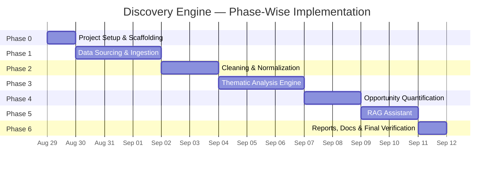
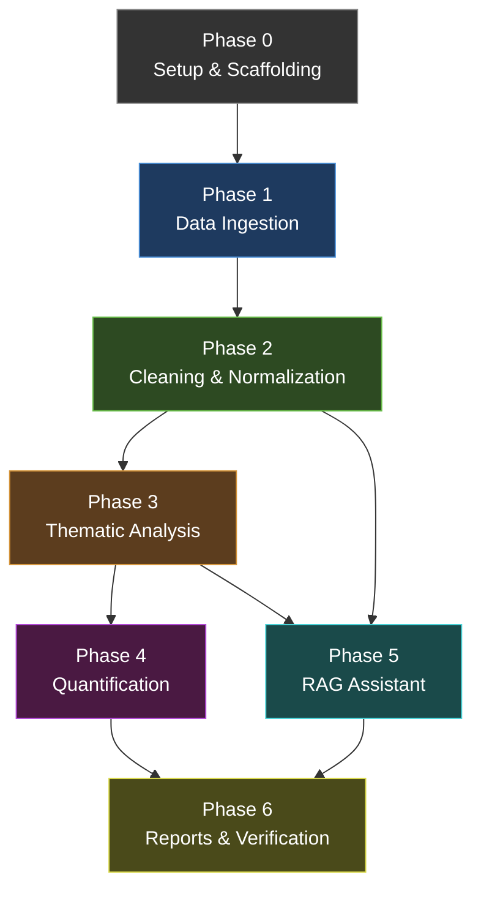

# Implementation Plan: Myntra Wishlist Discovery Engine

> **Source:** Derived from [architecture.md](file:///Users/daniamacbook/Desktop/NL%20Myntra/Docs/architecture.md) and [context.md](file:///Users/daniamacbook/Desktop/NL%20Myntra/Docs/context.md)
> **Approach:** Six phases, executed sequentially. Each phase has clear entry criteria, tasks, deliverables, verification steps, and exit criteria.

---

## Implementation Timeline Overview



---

## Phase 0: Project Setup & Scaffolding

**Goal:** Create the project skeleton, install all dependencies, configure environment, and validate that every tool in the stack is reachable.

### Entry Criteria
- Workspace exists at `NL Myntra/`
- Python 3.10+ installed
- Node.js 18+ installed (for frontend)
- Apify API token available (free tier)
- Google Gemini API key available (free tier) OR Ollama installed locally
- Vercel account (free Hobby plan)
- Railway account (free Trial plan)

### Tasks

#### 0.1 — Directory Structure

Create the full project tree:

```
NL Myntra/
├── Docs/                          # Already exists
├── backend/
│   ├── src/
│   │   ├── ingestion/
│   │   │   └── __init__.py
│   │   ├── cleaning/
│   │   │   └── __init__.py
│   │   ├── analysis/
│   │   │   └── __init__.py
│   │   ├── quantification/
│   │   │   └── __init__.py
│   │   ├── rag/
│   │   │   └── __init__.py
│   │   └── utils/
│   │       └── __init__.py
│   ├── api/
│   │   ├── __init__.py
│   │   ├── main.py
│   │   ├── routes/
│   │   └── middleware/
│   ├── data/
│   │   ├── raw/
│   │   ├── clean/
│   │   ├── themes/
│   │   ├── matrix/
│   │   ├── research/
│   │   │   ├── interviews/
│   │   │   └── surveys/
│   │   └── vectorstore/
│   ├── reports/
│   ├── pipeline.py
│   ├── requirements.txt
│   ├── Procfile
│   ├── railway.toml
│   ├── Makefile
│   └── .env.example
├── frontend/
│   ├── src/
│   │   ├── app/
│   │   ├── components/
│   │   └── lib/
│   ├── package.json
│   ├── next.config.js
│   ├── vercel.json
│   └── tsconfig.json
├── .gitignore
└── README.md
```

#### 0.2 — Backend Dependencies (`backend/requirements.txt`)

```
# Scraping & Ingestion
apify-client>=1.6
requests>=2.31
beautifulsoup4>=4.12
google-api-python-client>=2.100   # YouTube Data API v3

# Cleaning
spacy>=3.7
datasketch>=1.6

# Analysis & LLM
google-genai>=1.0          # Gemini SDK
# OR: ollama (pip install ollama)

# RAG
sentence-transformers>=2.2
chromadb>=0.4
faiss-cpu>=1.7             # Alternative to ChromaDB

# API Server
fastapi>=0.110
uvicorn>=0.29
sse-starlette>=1.6         # Server-Sent Events for streaming

# Utilities
python-dotenv>=1.0
tqdm>=4.65
uuid6>=2022.6
pandas>=2.0                # For research data (CSV/JSON) ingestion
tiktoken>=0.5              # Token estimation for LLM budget checks
```

#### 0.2b — Frontend Setup (`frontend/`)

Initialize Next.js app:
```bash
cd frontend
npx -y create-next-app@latest ./ --typescript --tailwind --eslint --app --src-dir --no-import-alias
npm install
```

Additional frontend dependencies:
```bash
npm install react-markdown remark-gfm recharts lucide-react
```

#### 0.3 — Environment Configuration

Create `backend/.env.example`:
```
APIFY_API_TOKEN=your_apify_token_here
GEMINI_API_KEY=your_gemini_api_key_here
YOUTUBE_API_KEY=your_youtube_data_api_v3_key_here
LLM_PROVIDER=gemini           # or "ollama"
OLLAMA_MODEL=llama3            # if using Ollama
FRONTEND_URL=http://localhost:3000    # or Vercel production URL
```

Create `frontend/.env.local`:
```
NEXT_PUBLIC_API_URL=http://localhost:8000    # or Railway production URL
```

Create `backend/src/utils/config.py` — centralized config loader:
- Reads `.env` via `python-dotenv`
- Exposes `LLM_PROVIDER`, `GEMINI_API_KEY`, `APIFY_API_TOKEN`, `FRONTEND_URL`
- Defines paths: `RAW_DIR`, `CLEAN_DIR`, `THEMES_DIR`, `MATRIX_DIR`, `VECTORSTORE_DIR`, `REPORTS_DIR`, `RESEARCH_DIR`

#### 0.4 — Utility Modules

| File | Purpose |
|---|---|
| `src/utils/config.py` | Centralized config, paths, env loading |
| `src/utils/logger.py` | Structured logging with `logging` module, file + console output |
| `src/utils/cache.py` | JSONL-based cache: `cache_key(input_hash) → cached_result`. Skip LLM calls on cache hit. |
| `src/utils/rate_limiter.py` | Token-bucket rate limiter with per-platform config and exponential backoff |
| `src/utils/llm_client.py` | Unified LLM interface — wraps Gemini and Ollama behind a single `generate(prompt, system_prompt) → str`. **Before every call:** (1) estimate input tokens via `tiktoken`, (2) check RPM budget (Gemini free tier: 15 RPM), (3) check daily request budget (1,500 RPD), (4) if budget exceeded → queue or fall back to Ollama, (5) on HTTP 429 → exponential backoff (1s–2s–4s–8s, max 60s), (6) cache result keyed by `hash(prompt + system_prompt)`, (7) on cache hit → skip API call entirely, (8) retry only on transient errors (429, 503), NOT on 400/invalid. No module calls Gemini directly — all calls route through this client. |

#### 0.5 — Pipeline Orchestrator Skeleton

Create `pipeline.py` with argparse:

```python
# pipeline.py — stage runner
# Flags: --ingest, --clean, --analyze, --quantify, --rag-build, --rag-serve, --all
# Each flag calls the corresponding stage module's entry point
# --all runs stages 1–5 sequentially
```

#### 0.6 — Smoke Tests

| Test | Expected Result |
|---|---|
| `python -c "import spacy; nlp = spacy.load('en_core_web_sm'); print('OK')"` | spaCy model loads |
| `python -c "from apify_client import ApifyClient; print('OK')"` | Apify client importable |
| `python -c "from google import genai; print('OK')"` | Gemini SDK importable |
| `python -c "import chromadb; chromadb.Client(); print('OK')"` | ChromaDB creates in-memory store |
| `python -c "from sentence_transformers import SentenceTransformer; SentenceTransformer('BAAI/bge-small-en-v1.5'); print('OK')"` | BGE-small embedding model downloads & loads |
| `python -c "from sentence_transformers import CrossEncoder; CrossEncoder('cross-encoder/ms-marco-MiniLM-L-6-v2'); print('OK')"` | Reranker model downloads & loads |
| `python -c "import tiktoken; print('OK')"` | Token estimator importable |
| `cd frontend && npm run dev` (then kill) | Next.js dev server starts on port 3000 |
| `cd backend && uvicorn api.main:app --port 8000` (then kill) | FastAPI server starts on port 8000 |

### Deliverables
- [ ] Full directory structure created
- [ ] `requirements.txt` with all dependencies
- [ ] `.env.example` and `src/utils/config.py`
- [ ] All five utility modules (`config`, `logger`, `cache`, `rate_limiter`, `llm_client`)
- [ ] `pipeline.py` skeleton with argparse
- [ ] All smoke tests pass

### Exit Criteria
All imports succeed, LLM client returns a test response, directory structure in place.

---

## Phase 1: Data Sourcing & Ingestion

**Goal:** Build platform-specific scrapers and a research data ingester that collect raw public conversations and first-party research data, storing them as JSONL with metadata, respecting ToS and rate limits.

### Entry Criteria
- Phase 0 complete (all dependencies installed, utilities working)
- Apify API token configured

### Tasks

#### 1.1 — Base Scraper Interface

Create `backend/src/ingestion/base_scraper.py`:

```python
class BaseScraper(ABC):
    """Abstract interface for all platform scrapers."""
    
    @abstractmethod
    def configure(self, query_terms: list[str], recency_months: int, max_results: int) -> None: ...
    
    @abstractmethod
    def fetch(self) -> list[dict]:
        """Returns list of RawRecord dicts conforming to the raw schema."""
        ...
    
    @abstractmethod
    def get_source_name(self) -> str: ...
    
    def export(self, output_dir: str) -> str:
        """Fetches and writes JSONL to output_dir. Returns file path."""
        ...
```

Key behaviors:
- Auto-generates `record_id` (UUID v4) for each record
- Sets `ingestion_timestamp` to current ISO-8601
- Sets `source_type` to `"scraped"` for all scraped sources
- Strips any author/username fields from source API response before creating the record
- Validates against the raw data schema
- Writes to `data/raw/{platform}_{YYYY-MM}.jsonl`

#### 1.2 — Search Query Configuration

Create `backend/src/ingestion/config.py`:

```python
QUERY_TERMS = {
    "primary": [
        "myntra wishlist", "myntra shortlist", "myntra cart abandon",
        "myntra not buying", "myntra save for later", "myntra hesitate",
        "online fashion wishlist", "fashion shopping cart",
        "ajio wishlist", "fashion app wishlist",
        "myntra product review", "myntra quality"
    ],
    "extended": [
        "why I don't buy from wishlist", "fashion purchase decision",
        "online shopping indecision", "saved items never bought",
        "wishlist vs actually buying", "fashion try before buy",
        "myntra review", "myntra shopping experience",
        "online fashion india", "fashion haul india"
    ],
    "myntra_reviews": [
        "myntra.com",  # Product page URLs for review scraping
    ]
}

RECENCY_MONTHS = 12
TARGET_RECORDS_PER_SOURCE = 2000

PLATFORM_RATE_LIMITS = {
    "reddit":         {"requests_per_minute": 10, "daily_limit": 500},
    "quora":          {"requests_per_minute": 5,  "daily_limit": 200},
    "appstore":       {"requests_per_minute": 10, "daily_limit": 500},
    "playstore":      {"requests_per_minute": 10, "daily_limit": 500},
    "youtube":        {"requests_per_minute": 5,  "daily_limit": 300},
    "instagram":      {"requests_per_minute": 3,  "daily_limit": 200},
    "myntra_reviews": {"requests_per_minute": 5,  "daily_limit": 300},
    "forum":          {"requests_per_minute": 3,  "daily_limit": 100},
}

# Research data paths (pre-loaded by the user)
RESEARCH_DATA = {
    "interviews_dir": "data/research/interviews/",
    "surveys_dir": "data/research/surveys/",
}
```

#### 1.3 — Platform Scrapers

Each scraper extends `BaseScraper`. Implementation details per platform:

| File | Platform | Approach | Key Details |
|---|---|---|---|
| `reddit_scraper.py` | Reddit | Apify actors (`trudax--reddit-scraper-lite` or `automation-lab--reddit-scraper`) | Search subreddits: `r/india`, `r/IndianFashionAddicts`, `r/IndianSkincareAddicts`, `r/Myntra`. Fetch posts + comments. Strip `u/username` from all text. |
| `quora_scraper.py` | Quora | Apify actors (`fatihtahta--quora-scraper`, `crawlerbros--quora-search-scraper`) | Search by query terms. Fetch question + top answers. Strip author names. |
| `appstore_scraper.py` | App Store | Apify actor or `app-store-scraper` library | Target app IDs: Myntra, AJIO, Nykaa Fashion, Meesho. Fetch reviews with ratings. |
| `playstore_scraper.py` | Play Store | Apify actor or `google-play-scraper` library | Same app targets. Fetch reviews with ratings. |
| `youtube_scraper.py` | YouTube | Apify actor (`streamers--youtube-scraper`) + YouTube Data API v3 | Search: "myntra haul", "myntra try on", "myntra review", "ajio haul". **Primary:** YouTube Data API v3 (free tier: 10,000 quota units/day) for `commentThreads.list` and `search.list`. **Fallback:** Apify actor when API quota is exhausted. Fetch comments from top videos. Strip channel/commenter names. |
| `instagram_scraper.py` | Instagram | Apify actor (`apify--instagram-scraper`) | Search hashtags: #myntrahaul, #myntrafashion, #myntrareview, #myntrafinds, #ajiohaul. Fetch post captions + comments. Strip @handles and commenter usernames. |
| `myntra_scraper.py` | Myntra Product Reviews | Apify web scraper or `requests` + `bs4` | Scrape public product review pages. Extract review text, rating, product name, category. Strip reviewer names. |
| `forum_scraper.py` | Fashion Forums | `requests` + `BeautifulSoup` | Target: Indian fashion forums, StyleCracker community, etc. Check `robots.txt` first. Parse thread titles + posts. |

#### 1.3b — Research Data Ingester

Create `backend/src/ingestion/research_ingester.py`:

```python
class ResearchIngester:
    """Ingests first-party user research data (interviews & surveys)."""
    
    def load_interviews(self, interviews_dir: str) -> list[dict]:
        """
        Load interview transcripts from JSON/CSV files.
        Each file = one interview session.
        - Expects pre-anonymized participant IDs (P01, P02, ...)
        - Splits transcript into Q&A segments
        - Sets source_type = 'first_party_research'
        - Sets source_platform = 'interview'
        """
        ...
    
    def load_surveys(self, surveys_dir: str) -> list[dict]:
        """
        Load survey response exports (CSV/JSON).
        - Each row = one response to one open-ended question
        - Sets source_type = 'first_party_research'
        - Sets source_platform = 'survey'
        - Preserves survey_question in metadata
        """
        ...
    
    def export(self, output_dir: str) -> str:
        """Write combined research data to JSONL."""
        ...
```

> **Note:** User research data must be pre-anonymized before placing in `data/research/`. The ingester validates that no PII fields exist but does not perform the initial anonymization of participant identities.

#### 1.4 — Apify Integration Helper

Create `src/ingestion/apify_helper.py`:
- Wraps `ApifyClient` with free-tier quota tracking
- Logs remaining actor-seconds after each call
- Raises `QuotaExhaustedError` if free tier is depleted
- Supports async polling for actor run completion

```python
class ApifyHelper:
    def run_actor(self, actor_id: str, input_data: dict, timeout_secs: int = 300) -> list[dict]:
        """Run an Apify actor and return dataset items."""
        ...
    
    def get_remaining_quota(self) -> dict:
        """Returns remaining free-tier compute units."""
        ...
```

#### 1.5 — Ingestion Orchestrator

Create `src/ingestion/runner.py`:
- Instantiates all scrapers from config
- Runs them sequentially (to stay within Apify free-tier limits)
- Aggregates stats: records per platform, total records, errors
- Logs summary to console and `data/raw/ingestion_log.json`

```python
def run_ingestion() -> dict:
    """Run all scrapers + research ingester. Returns summary stats."""
    # Scraped sources
    scrapers = [RedditScraper(), QuoraScraper(), AppStoreScraper(), 
                PlayStoreScraper(), YouTubeScraper(), InstagramScraper(),
                MyntraScraper(), ForumScraper()]
    for scraper in scrapers:
        scraper.configure(QUERY_TERMS, RECENCY_MONTHS, TARGET_RECORDS_PER_SOURCE)
        scraper.export(RAW_DIR)
    
    # First-party research data
    research = ResearchIngester()
    research.load_interviews(RESEARCH_DATA["interviews_dir"])
    research.load_surveys(RESEARCH_DATA["surveys_dir"])
    research.export(RAW_DIR)
    
    return stats
```

### Verification

| Check | Method |
|---|---|
| Raw JSONL files exist in `data/raw/` | `ls data/raw/*.jsonl` |
| Each record has required fields | Schema validation script |
| No PII fields in raw records | `grep -i "username\|author\|email" data/raw/*.jsonl` returns nothing |
| Records fall within recency window | Spot-check timestamps |
| At least 3 platforms have data | Count distinct source files |
| Total records ≥ 1,000 | `wc -l data/raw/*.jsonl` |
| Myntra product reviews present | `data/raw/myntra_reviews_*.jsonl` exists |
| Research data ingested (if available) | `data/raw/interviews.jsonl` and/or `data/raw/surveys.jsonl` exist |

### Deliverables
- [ ] `base_scraper.py` — abstract interface
- [ ] `config.py` — query terms, rate limits, research data paths
- [ ] `reddit_scraper.py` — Reddit via Apify
- [ ] `quora_scraper.py` — Quora via Apify
- [ ] `appstore_scraper.py` — App Store reviews
- [ ] `playstore_scraper.py` — Play Store reviews
- [ ] `youtube_scraper.py` — YouTube comments via Data API v3 + Apify fallback
- [ ] `instagram_scraper.py` — Instagram comments/threads via Apify
- [ ] `myntra_scraper.py` — Myntra product reviews
- [ ] `forum_scraper.py` — Fashion forums via HTTP
- [ ] `research_ingester.py` — User interviews & surveys ingester
- [ ] `apify_helper.py` — Apify client wrapper with quota tracking
- [ ] `runner.py` — Ingestion orchestrator
- [ ] Raw JSONL data files in `data/raw/`

### Exit Criteria
≥1,000 raw records across ≥3 platforms (including Myntra reviews), all conforming to the raw schema, with no PII fields. Research data ingested if available.

---

## Phase 2: Cleaning & Normalization

**Goal:** Transform raw records into a PII-free, deduplicated, relevance-filtered, chunked corpus ready for LLM analysis.

### Entry Criteria
- Phase 1 complete (raw JSONL files in `data/raw/`)
- spaCy model `en_core_web_sm` downloaded

### Tasks

#### 2.1 — PII Stripper

Create `src/cleaning/pii_stripper.py`:

**Regex patterns:**
```python
PII_PATTERNS = {
    "email":    r'\b[A-Za-z0-9._%+-]+@[A-Za-z0-9.-]+\.[A-Z|a-z]{2,}\b',
    "handle":   r'@[\w]{1,30}',
    "phone":    r'(\+?\d{1,3}[-.\s]?)?\(?\d{3}\)?[-.\s]?\d{3}[-.\s]?\d{4}',
    "url_with_user": r'(?:u/|user/|profile/)[\w-]+',
}
```

**spaCy NER pass:**
- Load `en_core_web_sm`
- Detect `PERSON` entities and replace with `[REDACTED]`
- Keep `ORG` entities (Myntra, AJIO are relevant)

**Privacy log output:**
```json
{
  "run_timestamp": "ISO-8601",
  "records_processed": 5000,
  "pii_stripped": {
    "emails": 12,
    "handles": 234,
    "phone_numbers": 3,
    "person_names": 87
  }
}
```

#### 2.2 — Deduplicator

Create `src/cleaning/deduplicator.py`:

- Use `datasketch.MinHash` with 128 permutations
- Similarity threshold: 0.85
- Build LSH index over all records (cross-platform)
- For each duplicate cluster, keep the record with the most text / earliest timestamp
- Log: `{"duplicates_found": N, "records_removed": M, "clusters": [...]}`

#### 2.3 — Spam & Boilerplate Filter

Create `src/cleaning/spam_filter.py`:

**Filter rules:**

| Rule | Action |
|---|---|
| Word count < 10 | Remove |
| Exact match to known boilerplate ("nice app", "good", "worst app ever") | Remove |
| Repetitive characters (e.g., "aaaaaaa") > 50% of text | Remove |
| Promotional content (contains URL + "discount code", "use my link") | Remove |
| Non-English and non-Hindi/Hinglish | Remove |
| Pure delivery/logistics complaint with no wishlist/purchase signal | Remove |

**Output:** Filtered records + filter log with counts per rule.

#### 2.4 — Relevance Filter

Create `src/cleaning/relevance_filter.py`:

**Two-tier approach:**

**Tier 1 — Keyword match (fast, free):**
```python
RELEVANCE_KEYWORDS = [
    "wishlist", "shortlist", "save for later", "cart", "buy later",
    "not buying", "hesitate", "confused", "compare", "size", "fit",
    "expensive", "price", "reviews", "try on", "occasion", "wedding",
    "office wear", "styling", "similar", "alternative", "worth it",
    "quality", "return policy", "COD", "cash on delivery"
]
```
Records matching ≥1 keyword pass automatically.

**Tier 2 — LLM classifier (for ambiguous records):**
- Records with 0 keyword matches get a lightweight LLM call
- Prompt: "Does this text discuss fashion shopping decisions, wishlisting, or purchase hesitation? Reply YES or NO only."
- Cache results to avoid repeated LLM calls
- Batch 50 records per call for token efficiency

#### 2.5 — Chunker

Create `src/cleaning/chunker.py`:

| Content Type | Chunking Strategy |
|---|---|
| Reddit thread | Split into individual comments; each comment = 1 chunk |
| YouTube comment section | Each comment = 1 chunk |
| App/Play Store review | If > 300 tokens, split at sentence boundary with 50-token overlap; else keep as single chunk |
| Quora answer | If > 300 tokens, split at paragraph boundary; else keep as single chunk |
| Forum post | Split at paragraph boundary, max 300 tokens per chunk |

Each chunk inherits `parent_record_id`, `source_platform`, `timestamp` from its parent record. Gets its own `chunk_id` (UUID v4).

#### 2.6 — Cleaning Orchestrator

Create `src/cleaning/runner.py`:

```python
def run_cleaning() -> dict:
    """Execute full cleaning pipeline. Returns summary stats."""
    raw_records = load_all_raw()          # Read data/raw/*.jsonl
    
    stripped = pii_stripper.strip(raw_records)
    deduped = deduplicator.deduplicate(stripped)
    filtered = spam_filter.filter(deduped)
    relevant = relevance_filter.filter(filtered)
    chunks = chunker.chunk(relevant)
    
    save_corpus(chunks, CLEAN_DIR)        # Write data/clean/corpus.jsonl
    generate_privacy_log(REPORTS_DIR)     # Write reports/privacy_log.md
    
    return stats
```

### Verification

| Check | Method |
|---|---|
| `data/clean/corpus.jsonl` exists and has records | `wc -l data/clean/corpus.jsonl` |
| No PII in clean corpus | `grep -iP '@[\w]+|[\w]+@[\w]+\.\w+' data/clean/corpus.jsonl` returns nothing |
| Chunk count is 60–80% of raw record count | Compare `wc -l` of raw vs clean |
| Each chunk has all required fields | Schema validation |
| `reports/privacy_log.md` exists | Visual inspection |
| No duplicates (random sample check) | Run dedup again on output — should find 0 |

### Deliverables
- [ ] `pii_stripper.py` — PII removal with logging
- [ ] `deduplicator.py` — MinHash near-duplicate detection
- [ ] `spam_filter.py` — Boilerplate and spam removal
- [ ] `relevance_filter.py` — Keyword + LLM relevance classification
- [ ] `chunker.py` — Platform-aware text chunking
- [ ] `runner.py` — Cleaning orchestrator
- [ ] `data/clean/corpus.jsonl` — Clean corpus
- [ ] `reports/privacy_log.md` — Auto-generated privacy log

### Exit Criteria
Clean corpus exists with ≥500 chunks, zero PII, privacy log generated.

---

## Phase 3: Thematic Analysis Engine

**Goal:** Extract emergent themes from the corpus using a two-pass LLM approach (map-reduce), mapping each theme to research questions with verbatim evidence.

### Entry Criteria
- Phase 2 complete (`data/clean/corpus.jsonl` exists with ≥500 chunks)
- LLM client working (Gemini or Ollama)

### Tasks

#### 3.1 — Prompt Templates

Create `src/analysis/prompts.py`:

**Pass 1 — Micro-Theme Extraction Prompt:**

```python
MICRO_THEME_PROMPT = """
You are analyzing user conversations about online fashion shopping, wishlisting, 
and purchase decisions (primarily on Myntra/AJIO and similar platforms in India).

Below are {n} user conversation snippets. For each distinct theme you identify:

1. Give the theme a short, descriptive name (3-7 words)
2. Write a 1-2 sentence description of the friction or behavior
3. Tag it with the relevant research question IDs from this list:
   RQ1: Why do users add products to wishlist?
   RQ2: What prevents wishlisted items from being purchased?
   RQ3: What uncertainties remain after liking a product?
   RQ4: What causes users to postpone a purchase?
   RQ5: How do users compare shortlisted products?
   RQ6: What info do users seek outside the platform?
   RQ7: Role of fit, size, styling, price, reviews, occasion, social validation?
   RQ8: Wishlist as purchase intent vs. bookmarking?
   RQ9: How do behaviors differ across segments?
   RQ10: What unmet needs connect to 30-day conversion?
4. Quote the most representative verbatim snippet (max 50 words)
5. List the chunk_ids that support this theme

Return valid JSON array. No preamble.

SNIPPETS:
{snippets}
"""
```

**Pass 2 — Theme Consolidation Prompt:**

```python
CONSOLIDATION_PROMPT = """
Below are {n} micro-themes extracted from user conversations about fashion 
shopping and wishlisting. Many are overlapping or near-duplicates.

Consolidate them into 10-25 distinct macro-themes. For each:
1. Canonical name (3-7 words)
2. Description (2-3 sentences)  
3. Merged research question tags
4. List of micro-theme IDs being merged
5. Top 3 representative verbatim snippets from the merged evidence

Return valid JSON array. No preamble.

MICRO-THEMES:
{micro_themes}
"""
```

#### 3.2 — Pass 1: Micro-Theme Extractor

Create `src/analysis/theme_extractor.py`:

```python
class ThemeExtractor:
    def __init__(self, llm_client, cache, batch_size=20):
        ...
    
    def extract(self, corpus_chunks: list[dict]) -> list[dict]:
        """
        1. Sort chunks by source_platform (for diversity within batches)
        2. Create batches of batch_size chunks
        3. For each batch:
           a. Check cache — skip if already processed
           b. Format prompt with MICRO_THEME_PROMPT
           c. Call LLM
           d. Parse JSON response
           e. Cache result
        4. Return all micro-themes with chunk_id linkage
        """
        ...
```

**Batch formation strategy:**
- Interleave platforms within each batch (not all Reddit, then all Quora)
- This ensures each batch sees diverse perspectives, improving theme quality

**Error handling:**
- If LLM returns invalid JSON, retry once with "Fix this JSON" prompt
- If retry fails, log the batch and skip (don't block the pipeline)
- Track success rate: should be >95%

#### 3.3 — Pass 2: Theme Consolidator

Create `src/analysis/theme_consolidator.py`:

```python
class ThemeConsolidator:
    def __init__(self, llm_client):
        ...
    
    def consolidate(self, micro_themes: list[dict]) -> list[dict]:
        """
        1. If micro_themes fit in one context window (<100 themes), single call
        2. If too many, split into groups of 50, consolidate each, then consolidate results
        3. Assign theme_ids (T-001, T-002, ...)
        4. For each macro-theme, aggregate:
           - All chunk_ids from constituent micro-themes
           - chunk_count
           - source_platforms list and distribution
        5. Return final theme list
        """
        ...
```

#### 3.4 — Research Question Mapper

Create `src/analysis/research_mapper.py`:

```python
class ResearchMapper:
    RESEARCH_QUESTIONS = {
        "RQ1": "Why do users add fashion products to their wishlist?",
        "RQ2": "What prevents wishlisted products from eventually being purchased?",
        # ... RQ3–RQ10
    }
    
    def validate_coverage(self, themes: list[dict]) -> dict:
        """
        Check that every RQ (1-10) is covered by at least one theme.
        Returns coverage report:
        {
            "RQ1": {"covered": True, "themes": ["T-001", "T-008"]},
            "RQ2": {"covered": True, "themes": ["T-002", "T-003", "T-005"]},
            ...
            "uncovered": []  # Any RQs with no themes
        }
        """
        ...
    
    def fill_gaps(self, themes: list[dict], corpus: list[dict], uncovered_rqs: list[str]) -> list[dict]:
        """
        For any uncovered RQ, do a targeted LLM pass over corpus chunks
        to find evidence. If genuinely no evidence exists, document the gap.
        """
        ...
```

#### 3.5 — Analysis Orchestrator

Create `src/analysis/runner.py`:

```python
def run_analysis() -> dict:
    """Execute full thematic analysis. Returns summary."""
    corpus = load_corpus()
    
    # Pass 1
    extractor = ThemeExtractor(llm_client, cache, batch_size=20)
    micro_themes = extractor.extract(corpus)
    save_jsonl(micro_themes, THEMES_DIR / "micro_themes.jsonl")
    
    # Pass 2
    consolidator = ThemeConsolidator(llm_client)
    themes = consolidator.consolidate(micro_themes)
    
    # Validate RQ coverage
    mapper = ResearchMapper()
    coverage = mapper.validate_coverage(themes)
    if coverage["uncovered"]:
        themes = mapper.fill_gaps(themes, corpus, coverage["uncovered"])
    
    save_jsonl(themes, THEMES_DIR / "themes.jsonl")
    save_json(coverage, THEMES_DIR / "rq_coverage.json")
    
    return stats
```

### Verification

| Check | Method |
|---|---|
| `data/themes/themes.jsonl` exists with 10–25 themes | `wc -l` and manual count |
| `data/themes/micro_themes.jsonl` exists | File exists check |
| Every theme has ≥1 evidence snippet with `chunk_id` | Schema validation |
| All 10 research questions are covered | Check `rq_coverage.json` — `uncovered` should be `[]` |
| No theme has 0 chunks | Validate `chunk_count > 0` for all |
| Cache directory populated | `ls data/themes/.cache/` |
| Theme names are distinct (no near-duplicates) | Manual review |

### Deliverables
- [ ] `prompts.py` — All LLM prompt templates
- [ ] `theme_extractor.py` — Pass 1 micro-theme extraction
- [ ] `theme_consolidator.py` — Pass 2 theme consolidation
- [ ] `research_mapper.py` — RQ coverage validation and gap filling
- [ ] `runner.py` — Analysis orchestrator
- [ ] `data/themes/micro_themes.jsonl` — Intermediate micro-themes
- [ ] `data/themes/themes.jsonl` — Final consolidated themes
- [ ] `data/themes/rq_coverage.json` — Research question coverage report

### Exit Criteria
10–25 themes exist, all 10 research questions covered, every theme traceable to real chunks.

---

## Phase 4: Opportunity Quantification & Prioritization

**Goal:** Score, rank, and segment-slice themes into a stakeholder-ready opportunity matrix and generate the thematic opportunity report.

### Entry Criteria
- Phase 3 complete (`data/themes/themes.jsonl` exists with 10–25 themes)
- All themes have `chunk_count`, `source_platforms`, and `evidence` populated

### Tasks

#### 4.1 — Scorer

Create `src/quantification/scorer.py`:

```python
class OpportunityScorer:
    WEIGHTS = {
        "frequency": 0.4,
        "platform_spread": 0.3,
        "purchase_delay_relevance": 0.3
    }
    
    def score_all(self, themes: list[dict], total_chunks: int, total_platforms: int) -> list[dict]:
        """
        For each theme:
        1. frequency_score = (chunk_count / total_chunks) * 100, capped at 100
        2. platform_spread_score = (len(source_platforms) / total_platforms) * 100
        3. purchase_delay_score = LLM-scored (0-100)
           Prompt: "On a scale of 0-100, how directly does this theme explain 
                    why a user would NOT convert a wishlisted fashion item 
                    into a purchase? Theme: {name} — {description}"
        4. opportunity_score = weighted sum
        5. Sort by opportunity_score descending, assign rank
        """
        ...
```

**LLM scoring prompt for purchase-delay relevance:**
- Batch all themes in a single call (they're only 10–25)
- Return JSON: `[{"theme_id": "T-001", "score": 91, "reasoning": "..."}, ...]`
- Cache the result

#### 4.2 — Segment Slicer

Create `src/quantification/segment_slicer.py`:

```python
class SegmentSlicer:
    CATEGORY_KEYWORDS = {
        "women_western": ["dress", "top", "skirt", "jeans", "western"],
        "women_ethnic": ["kurta", "saree", "lehenga", "salwar", "ethnic"],
        "men_casual": ["t-shirt", "shorts", "sneakers", "casual"],
        "men_formal": ["shirt", "trousers", "blazer", "formal"],
        "footwear": ["shoes", "heels", "sandals", "boots", "footwear"],
        "accessories": ["bag", "watch", "jewellery", "earrings", "sunglasses"],
    }
    
    PRICE_KEYWORDS = {
        "under_500": ["cheap", "budget", "under 500", "₹500"],
        "500_1000": ["₹500", "₹1000", "500-1000"],
        "1000_3000": ["₹1000", "₹2000", "₹3000", "mid-range"],
        "above_3000": ["expensive", "premium", "₹3000", "₹5000", "high-end"],
    }
    
    OCCASION_KEYWORDS = {
        "everyday": ["daily", "office", "college", "casual", "regular"],
        "occasion": ["wedding", "party", "festival", "date", "special"],
    }
    
    def slice(self, themes: list[dict], corpus: list[dict]) -> list[dict]:
        """
        For each theme, count how many of its evidence chunks match 
        each segment category.
        
        Minimum sample-size rule:
        - Only include segments with ≥10 supporting chunks
        - Segments with 5–9 chunks are flagged as `low_confidence`
        - Segments with <5 chunks are excluded entirely
        - Don't force thin segments into the report
        """
        ...
```

#### 4.3 — Opportunity Matrix Generator

Create `src/quantification/matrix_generator.py`:

```python
class MatrixGenerator:
    def generate(self, scored_themes: list[dict]) -> dict:
        """
        Produces:
        1. data/matrix/matrix.json — full scored/ranked/segmented data
        2. reports/opportunity_report.md — human-readable report
        3. reports/segment_view.md — segment breakdown
        """
        ...
    
    def _generate_opportunity_report(self, themes: list[dict]) -> str:
        """
        Markdown report structure:
        
        # Thematic Opportunity Report
        ## Executive Summary
        ## Methodology
        ## Opportunity Matrix (ranked table)
        ## Theme Deep Dives (one section per theme, ranked)
            ### T-001: [Theme Name] (Rank #1, Score: 83.5)
            - Description
            - Research Questions Addressed
            - Evidence (3-5 anonymized verbatim quotes with source)
            - Frequency & Source Spread
            - Segment Breakdown (if available)
        ## Research Question Coverage
        ## Data Sources Summary
        ## Limitations & Caveats
        """
        ...
    
    def _generate_segment_view(self, themes: list[dict]) -> str:
        """
        Markdown report:
        
        # Segment-Cut View
        ## By Product Category
        ## By Price Band
        ## By Occasion Type
        ## By User Type (where inferable)
        
        Each section: table of themes ranked within that segment.
        """
        ...
```

#### 4.4 — Quantification Orchestrator

Create `src/quantification/runner.py`:

```python
def run_quantification() -> dict:
    """Score, rank, segment, and generate reports."""
    themes = load_themes()
    corpus = load_corpus()
    
    scorer = OpportunityScorer(llm_client)
    scored = scorer.score_all(themes, len(corpus), count_platforms(corpus))
    
    slicer = SegmentSlicer()
    segmented = slicer.slice(scored, corpus)
    
    generator = MatrixGenerator()
    generator.generate(segmented)
    
    return stats
```

### Verification

| Check | Method |
|---|---|
| `data/matrix/matrix.json` exists | File exists, valid JSON |
| All themes have `opportunity_score` and `rank` | Schema validation |
| Themes are sorted by score descending | Check rank ordering |
| `reports/opportunity_report.md` exists | File exists, >1000 words |
| Report covers all 10 research questions | Search for RQ1–RQ10 in report |
| Every theme in report has ≥1 verbatim quote | Visual inspection |
| `reports/segment_view.md` exists | File exists |
| Scores are in 0–100 range | Bounds check |
| No segment has fewer than 10 chunks (or is flagged `low_confidence`) | Check `segment_cuts` in matrix.json |

### Deliverables
- [ ] `scorer.py` — Three-axis scoring with composite score
- [ ] `segment_slicer.py` — Category/price/occasion segmentation
- [ ] `matrix_generator.py` — Matrix + report generation
- [ ] `runner.py` — Quantification orchestrator
- [ ] `data/matrix/matrix.json` — Ranked opportunity matrix
- [ ] `reports/opportunity_report.md` — Full thematic opportunity report
- [ ] `reports/segment_view.md` — Segment-cut view

### Exit Criteria
Opportunity matrix with all themes ranked, opportunity report answering all 10 RQs with evidence, segment view generated.

---

## Phase 5: RAG Assistant + Web Application

**Goal:** Build a RAG-powered Q&A system with a FastAPI backend (deployed to Railway) and a Next.js frontend (deployed to Vercel), with source-cited responses grounded in real evidence.

### Entry Criteria
- Phase 2 complete (`data/clean/corpus.jsonl` exists)
- Phase 3 complete (`data/themes/themes.jsonl` exists)
- `sentence-transformers` and `chromadb` installed
- Node.js 18+ and Next.js app initialized

### Tasks

#### 5.1 — BGE-small Embedder

Create `backend/src/rag/embedder.py`:

```python
class CorpusEmbedder:
    def __init__(self, config: RAGConfig):
        self.model_name = config.EMBEDDING_MODEL  # default: "BAAI/bge-small-en-v1.5"
        self.query_prefix = config.QUERY_PREFIX    # default: "Represent this sentence..."
        self.batch_size = config.EMBED_BATCH_SIZE  # default: 64
        self.model = SentenceTransformer(self.model_name)
    
    def embed_corpus(self, chunks: list[dict]) -> list[tuple[str, list[float], dict]]:
        """
        Returns list of (chunk_id, embedding_vector, metadata) tuples.
        Metadata includes: source_platform, source_type, text (truncated 
        to 500 chars for display), parent_record_id, timestamp.
        BGE-small produces 384-dim embeddings.
        Processes in configurable batch sizes to manage memory.
        """
        ...
    
    def embed_themes(self, themes: list[dict]) -> list[tuple[str, list[float], dict]]:
        """
        Embed theme descriptions + top evidence snippets.
        Metadata includes: theme_id, name, research_questions.
        """
        ...
    
    def embed_query(self, query: str) -> list[float]:
        """
        Embed a user query string.
        BGE instruction-aware: prepend configurable query prefix
        for better retrieval.
        """
        ...
```

#### 5.1b — RAG Configuration

Create `backend/src/rag/rag_config.py`:

```python
from dataclasses import dataclass, field

@dataclass
class RAGConfig:
    """All retrieval/embedding/reranking settings in one place."""
    
    # Embedding
    EMBEDDING_MODEL: str = "BAAI/bge-small-en-v1.5"
    EMBEDDING_DIM: int = 384
    QUERY_PREFIX: str = "Represent this sentence for searching relevant passages: "
    EMBED_BATCH_SIZE: int = 64
    
    # Initial retrieval
    INITIAL_TOP_K: int = 20          # Candidates from vector store
    RETRIEVAL_SCOPE: str = "both"    # "corpus", "themes", or "both"
    
    # Reranker
    RERANKER_MODEL: str = "cross-encoder/ms-marco-MiniLM-L-6-v2"
    RERANKER_ENABLED: bool = True
    
    # Final selection
    FINAL_TOP_K: int = 8             # Snippets sent to LLM
    
    # Context window
    MAX_CONTEXT_TOKENS: int = 3000   # Token budget for retrieved context
```

#### 5.2 — Vector Store

Create `backend/src/rag/vector_store.py`:

```python
class VectorStore:
    def __init__(self, persist_dir: str):
        self.client = chromadb.PersistentClient(path=persist_dir)
    
    def build_index(self, corpus_chunks: list[dict], themes: list[dict]):
        """
        Create two collections:
        - 'corpus_chunks': BGE-small embeddings of clean corpus chunks (scraped + research)
        - 'theme_summaries': BGE-small embeddings of theme descriptions + evidence
        
        Upserts to handle re-indexing gracefully.
        """
        ...
    
    def query(self, query_embedding: list[float], top_k: int = 20) -> list[dict]:
        """
        Query both collections, merge results, deduplicate by chunk_id,
        return top_k results sorted by cosine similarity.
        
        Returns INITIAL candidates (pre-rerank). top_k here = INITIAL_TOP_K.
        Each result includes: chunk_id/theme_id, text, source_platform,
        source_type, relevance_score, collection_name.
        """
        ...
```

#### 5.3 — Reranker

Create `backend/src/rag/reranker.py`:

```python
from sentence_transformers import CrossEncoder

class Reranker:
    def __init__(self, config: RAGConfig):
        self.model_name = config.RERANKER_MODEL  # default: cross-encoder/ms-marco-MiniLM-L-6-v2
        self.enabled = config.RERANKER_ENABLED
        self.model = CrossEncoder(self.model_name) if self.enabled else None
    
    def rerank(self, query: str, candidates: list[dict], top_k: int = 8) -> list[dict]:
        """
        Re-score candidates using the cross-encoder.
        
        1. Create (query, candidate_text) pairs
        2. Score all pairs with the cross-encoder
        3. Sort by cross-encoder score descending
        4. Return top_k results with updated relevance_score
        
        If reranker is disabled, simply truncate to top_k by original score.
        """
        ...
```

#### 5.4 — Retriever (Retrieve → Rerank → Top-K)

Create `backend/src/rag/retriever.py`:

```python
class Retriever:
    def __init__(self, embedder: CorpusEmbedder, vector_store: VectorStore, 
                 reranker: Reranker, config: RAGConfig):
        self.initial_k = config.INITIAL_TOP_K   # 15–20
        self.final_k = config.FINAL_TOP_K       # 5–8
        ...
    
    def retrieve(self, query: str) -> list[dict]:
        """
        Full retrieval pipeline:
        1. Embed the query (with BGE-small instruction prefix)
        2. Retrieve INITIAL_TOP_K (15–20) candidates from vector store
        3. Rerank candidates using cross-encoder
        4. Select FINAL_TOP_K (5–8) by reranker score
        5. Format results with source metadata for the generator
        6. Return ranked list of context snippets with citations
        """
        ...
```

#### 5.5 — Answer Generator (with Citation Validation)

Create `backend/src/rag/generator.py`:

```python
class AnswerGenerator:
    SYSTEM_PROMPT = """
    You are a research assistant for the Myntra Growth team. You answer questions 
    about fashion shopping, wishlisting, and purchase behavior based ONLY on the 
    retrieved evidence provided below.
    
    Rules:
    1. Only use information from the provided context snippets
    2. Cite every claim with [Source: {platform}, ID: {chunk_id}]
    3. If the evidence is insufficient to answer, say so explicitly
    4. Never invent or hallucinate information
    5. Never reproduce any personally identifying information
    6. Be specific and quantitative where the evidence supports it
    7. When citing user research (interviews/surveys), use [Source: Interview, ID: ...] 
       or [Source: Survey, ID: ...]
    """
    
    def generate(self, query: str, context_snippets: list[dict]) -> str:
        """
        1. Format context snippets into numbered reference blocks
        2. Estimate input tokens (tiktoken) and check LLM budget
        3. Build prompt: system_prompt + context + user_query
        4. Call LLM (via llm_client — handles rate limiting, caching, backoff)
        5. Validate citations:
           a. Count [Source: ...] tags in response
           b. If 0 citations found and response is substantive → retry once
              with stronger citation instruction appended
           c. Verify cited chunk_ids exist in provided context_snippets
           d. Flag any hallucinated chunk_ids (cite IDs not in context)
        6. Return formatted response with validation metadata
        """
        ...
    
    def _validate_citations(self, response: str, context_snippets: list[dict]) -> dict:
        """
        Returns:
        {
            "citation_count": int,
            "valid_citations": list[str],     # chunk_ids that exist in context
            "hallucinated_citations": list[str],  # chunk_ids NOT in context
            "uncited_claims": int,             # factual sentences without citations
            "is_valid": bool                   # True if citation_count > 0 and no hallucinated_citations
        }
        """
        ...
    
    async def generate_stream(self, query: str, context_snippets: list[dict]):
        """
        Streaming version for SSE responses to the frontend.
        Yields chunks as they are generated by the LLM.
        Citation validation runs post-stream and is appended as a final event.
        """
        ...
```

#### 5.5 — FastAPI Backend (Railway)

Create `backend/api/main.py`:

```python
from fastapi import FastAPI
from fastapi.middleware.cors import CORSMiddleware
from sse_starlette.sse import EventSourceResponse

app = FastAPI(title="Myntra Discovery Engine API")

# CORS — allow Vercel frontend
app.add_middleware(
    CORSMiddleware,
    allow_origins=[FRONTEND_URL, "http://localhost:3000"],
    allow_methods=["*"],
    allow_headers=["*"],
)

# Initialize RAG components on startup
@app.on_event("startup")
async def startup():
    config = RAGConfig()
    app.state.embedder = CorpusEmbedder(config)
    app.state.vector_store = VectorStore(VECTORSTORE_DIR)
    app.state.reranker = Reranker(config)
    app.state.retriever = Retriever(app.state.embedder, app.state.vector_store, 
                                    app.state.reranker, config)
    app.state.generator = AnswerGenerator(llm_client)
```

Create `backend/api/routes/query.py`:

```python
@router.post("/api/query")
async def query_rag(request: QueryRequest):
    """
    Accept user query, retrieve context, generate cited answer.
    Supports both standard JSON response and SSE streaming.
    """
    context = retriever.retrieve(request.query)
    if request.stream:
        return EventSourceResponse(generator.generate_stream(request.query, context))
    else:
        response = generator.generate(request.query, context)
        return {"answer": response, "sources": context}
```

Create `backend/api/routes/themes.py`, `matrix.py`, `report.py`:

```python
@router.get("/api/themes")
async def get_themes():
    """Return all themes with scores, evidence, and research question mappings."""
    ...

@router.get("/api/matrix")
async def get_matrix():
    """Return ranked opportunity matrix data."""
    ...

@router.get("/api/report")
async def get_report():
    """Return the full opportunity report as markdown."""
    ...

@router.get("/api/health")
async def health():
    return {"status": "ok"}
```

Create `backend/Procfile` (for Railway):
```
web: uvicorn api.main:app --host 0.0.0.0 --port ${PORT:-8000}
```

Create `backend/railway.toml`:
```toml
[build]
builder = "nixpacks"

[deploy]
startCommand = "uvicorn api.main:app --host 0.0.0.0 --port ${PORT:-8000}"
healthcheckPath = "/api/health"
restartPolicyType = "on_failure"
```

#### 5.6 — Next.js Frontend (Vercel)

Create key frontend components:

**`frontend/src/app/page.tsx`** — Landing page with chat interface:
- Full-screen chat UI with message history
- Streaming response display (SSE)
- Source citations rendered as expandable cards
- Example query suggestions
- Link to report and matrix views

**`frontend/src/components/ChatInterface.tsx`**:
```typescript
// Core chat component
// - Input field with send button
// - Message list (user + assistant alternating)
// - Streaming text display via EventSource
// - Citation cards below each assistant message
// - Loading state with skeleton animation
```

**`frontend/src/components/CitationCard.tsx`**:
```typescript
// Expandable card showing source snippet
// - Platform badge (Reddit, App Store, Interview, Survey, Myntra Reviews, etc.)
// - Truncated text with "Show more" toggle
// - Chunk ID for traceability
```

**`frontend/src/app/report/page.tsx`** — Opportunity report viewer:
- Renders `opportunity_report.md` fetched from backend as formatted HTML
- Table of contents sidebar
- Theme cards with evidence quotes

**`frontend/src/app/matrix/page.tsx`** — Opportunity matrix visualization:
- Interactive chart (Recharts) showing themes plotted by frequency × impact
- Click on theme to see details
- Filter by research question

**`frontend/src/lib/api.ts`**:
```typescript
const API_BASE = process.env.NEXT_PUBLIC_API_URL;

export async function queryRAG(query: string, stream: boolean = true) { ... }
export async function getThemes() { ... }
export async function getMatrix() { ... }
export async function getReport() { ... }
```

Create `frontend/vercel.json`:
```json
{
  "framework": "nextjs",
  "buildCommand": "npm run build",
  "outputDirectory": ".next"
}
```

#### 5.7 — RAG Orchestrator

Create `backend/src/rag/runner.py`:

```python
def build_rag_index() -> dict:
    """Build/rebuild the vector index with BGE-small embeddings."""
    corpus = load_corpus()
    themes = load_themes()
    config = RAGConfig()
    
    embedder = CorpusEmbedder(config)  # BAAI/bge-small-en-v1.5
    vector_store = VectorStore(VECTORSTORE_DIR)
    vector_store.build_index(corpus, themes)
    
    return {"corpus_chunks_indexed": len(corpus), "themes_indexed": len(themes)}

def serve_api():
    """Launch the FastAPI server (for local development)."""
    import uvicorn
    uvicorn.run("api.main:app", host="0.0.0.0", port=8000, reload=True)
```

#### 5.8b — Retrieval Evaluation Benchmark

Create `backend/src/rag/evaluator.py`:

```python
class RetrievalEvaluator:
    """
    Evaluates retrieval quality with a benchmark of 20–30 test queries
    spanning English, Hindi, and Hinglish.
    """
    
    def __init__(self, retriever: Retriever, benchmark_path: str):
        ...
    
    def load_benchmark(self) -> list[dict]:
        """
        Load benchmark queries from data/eval/benchmark_queries.json.
        Each query has: query_text, language (en/hi/hinglish), 
        expected_relevant_chunk_ids, research_questions.
        """
        ...
    
    def evaluate(self) -> dict:
        """
        For each benchmark query:
        1. Run retriever.retrieve(query)
        2. Compare retrieved chunk_ids against expected_relevant_chunk_ids
        3. Compute:
           - Recall@5: fraction of relevant chunks in top 5
           - Recall@10: fraction of relevant chunks in top 10
           - MRR: 1 / rank_of_first_relevant_chunk
        4. Also compute BGE-only vs. BGE+reranker metrics for comparison
        
        Returns:
        {
            "overall": {"recall_at_5": 0.72, "recall_at_10": 0.88, "mrr": 0.65},
            "by_language": {
                "en": {"recall_at_5": ..., ...},
                "hi": {"recall_at_5": ..., ...},
                "hinglish": {"recall_at_5": ..., ...}
            },
            "reranker_lift": {
                "recall_at_5_without_rerank": 0.58,
                "recall_at_5_with_rerank": 0.72,
                "lift": "+24%"
            }
        }
        """
        ...
    
    def generate_report(self, results: dict) -> str:
        """Generate reports/retrieval_eval.md with detailed per-query results."""
        ...
```

Create `backend/data/eval/benchmark_queries.json`:

```json
[
    {"query": "Why do users add items to their wishlist?", "language": "en", "rqs": ["RQ1"], "expected_chunks": ["..."]},
    {"query": "What prevents users from buying wishlisted items?", "language": "en", "rqs": ["RQ2"], "expected_chunks": ["..."]},
    {"query": "myntra pe wishlist mein kyun rakhte ho?", "language": "hi", "rqs": ["RQ1"], "expected_chunks": ["..."]},
    {"query": "why myntra ki wishlist se kuch nahi khareedta", "language": "hinglish", "rqs": ["RQ2"], "expected_chunks": ["..."]},
    "... (20–30 total queries)"
]
```

> **Note:** Expected chunk IDs are populated after Phase 2 produces the clean corpus. A manual labeling pass of ~3–5 relevant chunks per query is required.

#### 5.8 — Deployment

**Railway (Backend):**
```bash
# From backend/ directory
railway login
railway link
railway up
```

**Vercel (Frontend):**
```bash
# From frontend/ directory
vercel login
vercel link
vercel deploy --prod
```

Set environment variables on each platform:
- **Railway:** `GEMINI_API_KEY`, `FRONTEND_URL` (Vercel URL)
- **Vercel:** `NEXT_PUBLIC_API_URL` (Railway URL)

### Verification

| Check | Method |
|---|---|
| Vector store index built in `data/vectorstore/` | Directory exists with files |
| Index contains both `corpus_chunks` and `theme_summaries` collections | ChromaDB collection list |
| Reranker model loads | Import + score a test pair |
| FastAPI server starts locally | `uvicorn api.main:app` on port 8000 |
| Next.js dev server starts locally | `npm run dev` on port 3000 |
| `/api/health` returns OK + LLM quota status | `curl http://localhost:8000/api/health` |
| `/api/query` returns cited response | POST test query, check `[Source: ...]` in response |
| Retrieval pipeline runs (retrieve → rerank → top-K) | Log shows initial_k=20, reranked, final_k=8 |
| Citation validation catches hallucinated IDs | Test with a fabricated chunk_id, verify rejection |
| Frontend chat interface works | Open `http://localhost:3000`, ask a question |
| Streaming responses work | Verify text appears incrementally in chat UI |
| Citation cards display correctly | Check source badges and expandable snippets |
| Report page renders | Navigate to `/report`, verify markdown rendering |
| Matrix page renders | Navigate to `/matrix`, verify chart display |
| Railway deployment works | `railway up`, hit production URL |
| Vercel deployment works | `vercel deploy`, hit production URL |
| Responses don't hallucinate beyond evidence | Ask an out-of-scope question, verify "insufficient evidence" response |
| Response time < 15 seconds per query | Timing test on production |
| Retrieval benchmark passes | Recall@5 ≥0.70, Recall@10 ≥0.85, MRR ≥0.60 |
| Hindi/Hinglish queries retrieve relevant results | Check benchmark results by language |
| Reranker improves Recall@5 by ≥10% over BGE-only | Compare benchmark with/without reranker |

### Test Questions

Run these validation queries via the frontend and verify citation quality:

| # | Query | Language | Expected Evidence Source |
|---|---|---|---|
| 1 | "Why do users add items to their wishlist?" | EN | Themes tagged RQ1 |
| 2 | "What prevents users from buying wishlisted items?" | EN | Themes tagged RQ2 |
| 3 | "How do size and fit concerns affect purchases?" | EN | Themes tagged RQ3, RQ7 |
| 4 | "Do users use the wishlist as a bookmark?" | EN | Themes tagged RQ8 |
| 5 | "What do users search for outside Myntra before buying?" | EN | Themes tagged RQ6 |
| 6 | "myntra pe wishlist mein kyun rakhte ho?" | HI | Themes tagged RQ1 |
| 7 | "why myntra ki wishlist se kuch nahi khareedta" | Hinglish | Themes tagged RQ2 |

### Deliverables
- [ ] `rag_config.py` — Configurable embedding/retrieval/reranking settings
- [ ] `embedder.py` — BGE-small embedding wrapper (`BAAI/bge-small-en-v1.5`, 384-dim)
- [ ] `reranker.py` — Cross-encoder reranker (`ms-marco-MiniLM-L-6-v2`)
- [ ] `vector_store.py` — ChromaDB/FAISS index management
- [ ] `retriever.py` — Retrieve → rerank → top-K pipeline
- [ ] `generator.py` — LLM answer generation with citation validation + streaming
- [ ] `evaluator.py` — Retrieval benchmark (Recall@5/10, MRR, reranker lift)
- [ ] `data/eval/benchmark_queries.json` — 20–30 benchmark queries (EN + HI + Hinglish)
- [ ] `reports/retrieval_eval.md` — Evaluation results report
- [ ] `api/main.py` — FastAPI app with CORS
- [ ] `api/routes/` — Query, themes, matrix, report, health endpoints
- [ ] `Procfile` + `railway.toml` — Railway deployment config
- [ ] `frontend/src/app/page.tsx` — Chat interface page
- [ ] `frontend/src/app/report/page.tsx` — Report viewer page
- [ ] `frontend/src/app/matrix/page.tsx` — Matrix visualization page
- [ ] `frontend/src/components/` — ChatInterface, CitationCard, ThemeCard, MatrixChart
- [ ] `frontend/src/lib/api.ts` — Backend API client
- [ ] `frontend/vercel.json` — Vercel deployment config
- [ ] `data/vectorstore/` — Persisted vector index
- [ ] Backend deployed to Railway
- [ ] Frontend deployed to Vercel

### Exit Criteria
RAG assistant answers questions with source-cited responses via the web UI (Vercel + Railway). Two-stage retrieval (BGE-small → reranker) produces high-quality context. Citation validation catches hallucinated references. Retrieval benchmark meets targets (Recall@5 ≥0.70, MRR ≥0.60). Hindi/Hinglish queries retrieve relevant results. Streaming works. Both local dev and production deployments functional.

---

## Phase 6: Reports, Documentation & Final Verification

**Goal:** Generate all final deliverables, write documentation, and run end-to-end verification against success criteria.

### Entry Criteria
- Phases 0–5 complete
- All data artifacts exist (`raw/`, `clean/`, `themes/`, `matrix/`, `vectorstore/`)
- Reports generated (`opportunity_report.md`, `segment_view.md`, `privacy_log.md`)

### Tasks

#### 6.1 — Final Report Review & Polish

Review and polish the auto-generated reports:

- `reports/opportunity_report.md` — Ensure all 10 RQs answered, all themes have evidence, matrix is readable
- `reports/segment_view.md` — Ensure segments are clearly labeled, thin data segments are flagged
- `reports/privacy_log.md` — Ensure all PII stripping is documented with counts

#### 6.2 — README

Create `README.md`:

```markdown
# Myntra Wishlist Discovery Engine

## Overview
AI-powered pipeline that analyzes public conversations and user research 
to understand why users wishlist but don't purchase fashion products.

## Architecture
Ingestion → Cleaning → Thematic Analysis → Quantification → RAG Assistant

## Quick Start

### Backend (Pipeline + API)
1. `cd backend && pip install -r requirements.txt`
2. `cp .env.example .env` and add API keys
3. Run pipeline: `python pipeline.py --all`
4. Start API: `uvicorn api.main:app --reload`

### Frontend
1. `cd frontend && npm install`
2. Create `.env.local` with `NEXT_PUBLIC_API_URL`
3. `npm run dev`

## Deployment
- **Frontend:** Vercel (Hobby plan) — `vercel deploy`
- **Backend:** Railway (Trial plan) — `railway up`

## Data Sources
App Store, Play Store, Reddit, Quora, YouTube, Myntra Product Reviews,
Fashion Forums, User Interviews, User Surveys

## Reports
- `reports/opportunity_report.md` — Ranked opportunity themes
- `reports/segment_view.md` — Segment breakdowns
- `reports/privacy_log.md` — Privacy & data handling

## Limitations
[Known limitations from architecture.md Section 11]

## Directory Structure
[Abbreviated tree]
```

#### 6.3 — Makefile

Create `backend/Makefile` with all convenience targets:

```makefile
.PHONY: install ingest clean analyze quantify rag-build api-dev all report

install:
	pip install -r requirements.txt
	python -m spacy download en_core_web_sm

ingest:
	python pipeline.py --ingest

clean:
	python pipeline.py --clean

analyze:
	python pipeline.py --analyze

quantify:
	python pipeline.py --quantify

rag-build:
	python pipeline.py --rag-build

api-dev:
	uvicorn api.main:app --reload --port 8000

all:
	python pipeline.py --all

report:
	python pipeline.py --quantify

deploy-backend:
	railway up

deploy-frontend:
	cd ../frontend && vercel deploy --prod
```

#### 6.4 — End-to-End Verification

Run the full pipeline from scratch and verify against all 6 success criteria:

| # | Success Criterion | Verification Method | Pass/Fail |
|---|---|---|---|
| SC1 | Report answers all 10 research questions with evidence | Search report for RQ1–RQ10, each has ≥1 theme with evidence | |
| SC2 | Opportunity areas ranked and quantified, not just listed | Check `matrix.json` — all themes have scores and ranks | |
| SC3 | Every theme and RAG answer traceable to real snippet | Check theme evidence has `chunk_id`; RAG answers have `[Source:]` | |
| SC4 | Entire build runs within free-tier tools | Review: no paid API calls, no paid infrastructure | |
| SC5 | No PII in stored data, reports, or RAG responses | Regex scan all output files for emails, handles, names | |
| SC6 | Output specific enough for follow-on solution design | Review: themes are actionable, not vague | |

#### 6.5 — Final PII Sweep

Run an automated final PII sweep across all output artifacts:

```bash
# Check all output files for potential PII
grep -rniP '@[\w]+' data/ reports/
grep -rniP '[\w]+@[\w]+\.\w+' data/ reports/
grep -rniP '\b\d{10}\b' data/ reports/
```

### Deliverables
- [ ] `reports/opportunity_report.md` — polished, final version
- [ ] `reports/segment_view.md` — polished, final version
- [ ] `reports/privacy_log.md` — complete privacy log
- [ ] `README.md` — setup, usage, architecture, limitations
- [ ] `Makefile` — convenience targets
- [ ] End-to-end verification passing all 6 success criteria
- [ ] Final PII sweep clean

### Exit Criteria
All deliverables exist and are polished. All 6 success criteria pass. PII sweep returns zero findings.

---

## Cross-Phase Dependency Map



> **Note:** Phase 5 (RAG) depends on Phase 2 (corpus) and Phase 3 (themes), but is independent of Phase 4 (quantification). In practice, run sequentially as designed, but RAG index can be built as soon as Phase 3 completes.

---

## Risk Register

| Risk | Likelihood | Impact | Mitigation |
|---|---|---|---|
| Apify free-tier quota exhausted mid-ingestion | Medium | High — blocks data collection | Spread across days; prioritize high-value sources first; use Python libraries as fallback |
| Gemini free-tier rate limit hit during analysis | Medium | Medium — slows pipeline | Use caching aggressively; fall back to Ollama |
| Insufficient data volume from some platforms | Medium | Low — reduced segment confidence | Document coverage gaps; don't force thin segments |
| LLM produces low-quality themes | Low | High — undermines report credibility | Human review checkpoint after Phase 3; tune prompts |
| Hinglish text causes PII leakage | Low | High — compliance risk | Additional manual review of Hinglish chunks; conservative PII regex |
| Invalid JSON from LLM responses | Medium | Low — handled by retry logic | Retry with "fix JSON" prompt; skip and log on persistent failure |
| Railway free-tier cold starts | Medium | Low — slow first response | Health check endpoint keeps container warm; document expected cold start latency |
| Myntra product page structure changes | Medium | Medium — breaks scraper | Defensive selectors; fallback to Apify actor; alert on parse failures |
| User research data quality varies | Low | Medium — inconsistent themes | Validate research data schema on ingestion; flag low-quality entries |

---

## Summary Checklist

| Phase | Key Output | Status |
|---|---|---|
| **Phase 0** | Project skeleton (`backend/` + `frontend/`), deps, utilities | ☐ |
| **Phase 1** | Raw data in `data/raw/` (≥1K records, ≥3 platforms + Myntra reviews + research) | ☐ |
| **Phase 2** | Clean corpus in `data/clean/` + privacy log | ☐ |
| **Phase 3** | Themes in `data/themes/` (10–25 themes, all RQs covered) | ☐ |
| **Phase 4** | Ranked matrix + opportunity report + segment view | ☐ |
| **Phase 5** | RAG assistant deployed (Vercel frontend + Railway backend) | ☐ |
| **Phase 6** | README, Makefile, all success criteria verified, both deployments live | ☐ |
