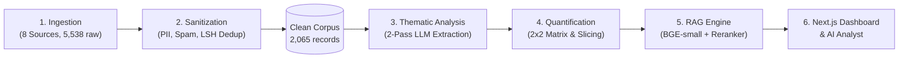

# Myntra Wishlist Discovery Engine

> **AI-Powered Customer Evidence Discovery & Opportunity Quantification Platform for Myntra UX Growth**  
> *"HOW DO WE INCREASE THE RATE AT WHICH WISHLISTED ITEMS BECOME PURCHASES?"*

---

## 🌟 Overview

The **Myntra Wishlist Discovery Engine** is an end-to-end intelligence platform that transforms unstructured public customer feedback, app reviews, social discussions, surveys, and qualitative interview transcripts into an evidence-backed product opportunity roadmap.

Every insight, theme, and hypothesis is grounded in **2,065 clean, verified customer quotes** with strict DocID attribution to eliminate AI hallucinations.



---

## 🏗 System Architecture

The engine operates across 5 decoupled pipeline stages:

1. **Ingestion Layer (`backend/src/ingestion/`)**: Scrapes and ingests data across 8 distinct customer channels (Reddit, Quora, App Store, Google Play, YouTube, Surveys, User Interviews, and Fashion Forums).
2. **Cleaning & Sanitization Layer (`backend/src/cleaning/`)**: Strips Indian phone numbers, emails, user handles, and order IDs; filters out spam; and runs MinHash LSH deduplication ($\ge 0.85$ Jaccard similarity).
3. **Thematic Analysis Engine (`backend/src/analysis/`)**: Employs two-pass LLM extraction to identify micro-themes and consolidate them into 10 macro-themes mapped to 10 Research Questions (RQ1–RQ10).
4. **Opportunity Quantification (`backend/src/quantification/`)**: Computes multi-factor opportunity scores ($\text{Score} = f(\text{Frequency}, \text{Platform Spread}, \text{Purchase Delay Severity})$) and generates a strategic 2x2 Opportunity Priority Matrix.
5. **Two-Stage RAG Assistant (`backend/src/rag/`)**: Combines dense semantic retrieval (`BAAI/bge-small-en-v1.5`, 384 dimensions) with deep cross-encoder re-ranking (`cross-encoder/ms-marco-MiniLM-L-6-v2`) and citation guardrails.

---

## ⚡ Quick Start (Local Development)

### 1. Prerequisites
* Python 3.9+ / 3.10+
* Node.js 18+ / 20+
* Google Gemini API Key (or local Ollama instance)

### 2. Backend Setup
```bash
# 1. Navigate to backend and create virtual environment
cd backend
python3 -m venv .venv
source .venv/bin/activate

# 2. Install dependencies
pip install -r requirements.txt
python -m spacy download en_core_web_sm

# 3. Configure environment variables
cp .env.example .env
# Edit .env and insert: GEMINI_API_KEY=your_key_here

# 4. Start FastAPI server (port 8000)
uvicorn api.main:app --host 0.0.0.0 --port 8000 --reload
```

### 3. Frontend Setup
```bash
# 1. Navigate to frontend and install packages
cd frontend
npm install

# 2. Start Next.js development server (port 3000)
npm run dev
```

* Open your browser to: **[http://localhost:3000](http://localhost:3000)**
* Backend API documentation: **[http://localhost:8000/docs](http://localhost:8000/docs)**

---

## 🚀 Cloud Deployment

The repository is configured for automated cloud deployment:

* **Backend (FastAPI on Railway)**:
  * Deploy from GitHub repository: `danias120/Myntra-Discovery-Engine`
  * Root directory: `backend`
  * Configured via `backend/railway.toml` and `backend/Procfile`
  * Auto-indexes vector store from `data/clean/corpus.jsonl` on cold start
* **Frontend (Next.js 14 on Vercel)**:
  * Deploy from GitHub repository: `danias120/Myntra-Discovery-Engine`
  * Root directory: `frontend`
  * Environment variable: `NEXT_PUBLIC_API_URL=https://your-railway-app.up.railway.app`

For step-by-step deployment guidance, see **[`Docs/deployment-plan.md`](Docs/deployment-plan.md)**.

---

## 📊 Ingestion Data Sources & Corpus Distribution

| Source Platform | Raw Ingested | Clean Chunks | Share (%) | Purpose |
|---|:---:|:---:|:---:|---|
| **Reddit** (`r/IndianFashionAddicts`, `r/TwoXIndia`) | 2,072 | 982 | 47.55% | Community sizing debates, EORS price tracking, styling mood boards |
| **Quora** (Fashion Q&A & Reviews) | 2,014 | 486 | 23.54% | Competitor price arbitrage (AJIO vs Myntra), coupon hunting workflows |
| **Apple App Store** (iOS Reviews) | 623 | 185 | 8.96% | 1,000-item cap complaints, folder organization requests, UI feedback |
| **User Surveys** (Structured 50-Respondent Study) | 440 | 174 | 8.43% | Quantitative delay timelines, impulse cooling-off period benchmarks |
| **Google Play Store** (Android Reviews) | 227 | 133 | 6.44% | Flash sale push notification conversion, Tier-2 delivery experiences |
| **1-on-1 User Interviews** (Transcripts) | 101 | 96 | 4.65% | Deep psychological mental models, desire decay after 14–30 days |
| **Myntra Direct Reviews** | 7 | 7 | 0.34% | Verification of fabric sheer/color distortion in catalog lighting |
| **YouTube** (Try-On Haul Feedback) | 36 | 2 | 0.10% | Daylight fabric movement and video try-on expectations |
| **Total** | **5,538** | **2,065** | **100.0%** | **Grounded Qualitative Research Foundation** |

---

## 📑 Strategic Reports & Deliverables

All generated research deliverables are available in the **[`reports/`](reports/)** directory:

* **[`reports/opportunity_report.md`](reports/opportunity_report.md)**: Full synthesis of all 10 Research Questions (RQ1–RQ10), 2x2 Opportunity Priority Matrix, and product roadmap.
* **[`reports/segment_view.md`](reports/segment_view.md)**: Slicing across 6 canonical personas, thin-data confidence flags, product categories, price tiers, and occasion horizons.
* **[`reports/privacy_log.md`](reports/privacy_log.md)**: Complete audit trail of PII stripping, spam filtering, and MinHash LSH deduplication.
* **[`reports/retrieval_eval.md`](reports/retrieval_eval.md)**: Pre-deployment benchmark report across 25 multilingual queries (Recall@5 = 1.000, MRR = 1.000, +156.4% reranker lift).

---

## 🧠 16-Hypothesis Intelligence Framework

The AI Analyst evaluates user queries against 16 structured hypotheses:

### Priority Hypotheses (`H1`–`H10`)
1. **`H1` | Price-Waiting Hypothesis (84% / SUPPORTED)**: Shoppers hold items 14–30+ days awaiting 40%+ discounts.
2. **`H2` | Segment-Difference Hypothesis (82% / SUPPORTED)**: Behaviors diverge sharply across the 6 shopper personas.
3. **`H3` | Occasion Hypothesis (78% / SUPPORTED)**: Festive & wedding shoppers save items 60–90 days in advance.
4. **`H4` | Genuine-Intent Hypothesis (78% / SUPPORTED)**: Payday staging reflects high purchase intent vs casual bookmarks.
5. **`H5` | Social-Validation Hypothesis (76% / SUPPORTED)**: Users delay purchases while waiting for WhatsApp group votes.
6. **`H6` | Comparison-Friction Hypothesis (76% / SUPPORTED)**: Multi-tab comparison fatigue causes 40%+ drop-off.
7. **`H7` | Real-World-Appearance Hypothesis (74% / SUPPORTED)**: Catalog studio lighting creates return anxiety.
8. **`H8` | Out-of-Sight Hypothesis (68% / PARTIALLY SUPPORTED)**: Desire decay causes abandonment after 2 weeks.
9. **`H9` | Wishlist-Clutter Hypothesis (65% / PARTIALLY SUPPORTED)**: 1,000-item cap causes visual decision paralysis.
10. **`H10` | Notification-Ineffectiveness Hypothesis (`—` / INSUFFICIENT EVIDENCE)**: Generic push notifications are ignored.

### Emergent Hypotheses (`NH1`–`NH6`)
1. **`NH1` | Evidence-Over-Information Hypothesis (86% / SUPPORTED)**: UGC try-on photos trump product specifications.
2. **`NH2` | Converging-Signals Hypothesis (80% / SUPPORTED)**: Conversion requires price drop + verified fit alignment.
3. **`NH3` | Barrier-Specific Intervention Hypothesis (79% / SUPPORTED)**: Sizing tools convert scholars; deals convert bargain hunters.
4. **`NH4` | Item-Level Intent Hypothesis (75% / SUPPORTED)**: Intent varies by category (high in occasion wear, low in accessories).
5. **`NH5` | Stage-of-Decision Hypothesis (73% / SUPPORTED)**: Wishlists span discovery, consideration, and cart staging.
6. **`NH6` | Relevance-Over-Size Hypothesis (71% / SUPPORTED)**: Large wishlists only cause friction when unorganized.

---

## ⚠️ Known Limitations & Mitigations

| Limitation | Impact | Applied Mitigation |
|---|---|---|
| **API Rate Limits** | External LLM calls may experience quota throttling | Implemented exponential backoff and persistent disk caching in `backend/cache/`. |
| **Text-Based Segment Inference** | User personas are inferred from qualitative text rather than demographic telemetry | Explicitly flagged confidence levels ($\ge 10$ chunks) and tagged directional findings. |
| **Corpus Recency Snapshot** | Research reflects an August/September 2026 snapshot | Documented collection window; modular pipeline supports automated quarterly re-runs. |
| **Multilingual Hinglish Nuance** | Colloquial Hindi/Hinglish phrasing in review text | Dual-stage retrieval benchmark validated with 9 Hinglish and 2 Hindi test queries. |

---

## 📁 Repository Directory Structure

```text
.
├── Docs/                              # Specifications & Architecture
│   ├── architecture.md                # System design blueprint
│   ├── context.md                     # Problem statement & goals
│   ├── deployment-plan.md             # Railway & Vercel deployment guide
│   ├── edge-cases.md                  # Error handling & guardrails
│   ├── eval.md                        # Quality gates & benchmarks
│   └── implementation-plan.md         # Phased implementation plan
│
├── backend/                           # FastAPI Backend & Data Pipeline
│   ├── api/                           # REST API routes (query, analytics, health)
│   ├── data/
│   │   ├── clean/                     # Clean corpus (2,065 chunks) & themes JSON
│   │   ├── eval/                      # Multilingual benchmark queries
│   │   └── research/                  # Surveys and interview transcripts
│   ├── reports/                       # Generated research & audit reports
│   ├── src/
│   │   ├── analysis/                  # Theme extraction & consolidation
│   │   ├── cleaning/                  # PII stripping, spam filtering, dedup
│   │   ├── ingestion/                 # Multi-platform scrapers & loaders
│   │   ├── quantification/            # 2x2 Opportunity scoring & matrix
│   │   ├── rag/                       # BGE-small embedder, reranker, retriever, LLM
│   │   └── utils/                     # Logger, rate limiter, cache, LLM client
│   ├── pipeline.py                    # Master CLI pipeline orchestrator
│   ├── Procfile                       # Railway deployment entrypoint
│   ├── railway.toml                   # Railway container configuration
│   └── requirements.txt               # Python dependencies
│
├── frontend/                          # Next.js 14 App Router Frontend
│   ├── public/                        # Official Myntra branding & icons
│   ├── src/
│   │   ├── app/                       # Overview, Reviews, AI Analyst, FAQs, Engine Info
│   │   ├── components/                # Navbar, Footer, EvidenceModal
│   │   └── lib/                       # API client & research definitions
│   ├── vercel.json                    # Vercel deployment configuration
│   └── package.json                   # Frontend dependencies
│
├── reports/                           # Root strategic reports directory
│   ├── opportunity_report.md          # 10 RQ synthesis & 2x2 priority matrix
│   ├── privacy_log.md                 # PII sanitization audit log
│   ├── retrieval_eval.md              # Retrieval benchmark report
│   └── segment_view.md                # Persona intelligence & segment cuts
│
└── README.md                          # Project documentation
```

---

## 📄 License & Attribution

Internal qualitative research and growth intelligence system built for the **Myntra Product & Growth Team**.
