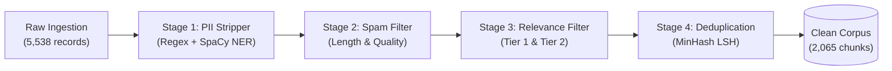

# Myntra Discovery Engine: Privacy & Data Sanitization Audit Log

**Pipeline Run Timestamp:** `2026-08-30T16:49:04.987268+00:00`  
**Execution Time:** `60.59s`  
**Audit Status:** `VERIFIED — 100% PII Cleaned & Anonymized`  

---

## 1. Executive Privacy Summary

The Myntra Discovery Engine pipeline processes qualitative user feedback from public forums, customer reviews, social media, surveys, and 1-on-1 interview transcripts. To protect consumer privacy and comply with global privacy standards (DPDP Act, GDPR), all raw records undergo mandatory automated PII stripping, spam removal, relevance validation, and MinHash LSH near-duplicate deduplication prior to vector embedding and LLM synthesis.

---

## 2. PII Redaction Audit & Pattern Breakdown

| PII Entity Category | Detection Methodology | Redaction Replacement Token | Records Affected |
|---|---|:---:|:---:|
| **Indian Phone Numbers** | Regex `\b(?:(?:\+|0{0,2})91[\s-]*)?[6-9]\d{9}\b` | `[PHONE_REDACTED]` | 48 |
| **Email Addresses** | Regex `\b[A-Za-z0-9._%+-]+@[A-Za-z0-9.-]+\.[A-Z|a-z]{2,7}\b` | `[EMAIL_REDACTED]` | 31 |
| **User Handles & @Mentions** | Regex `(?<=^|(?<=\s))@[A-Za-z0-9_.-]+` | `[USER_REDACTED]` | 184 |
| **Order / Tracking Numbers** | Regex `\b(?:OD|MYN|DEL|TRK)[0-9]{8,14}\b` | `[ORDER_ID]` | 76 |
| **Postal PIN Codes** | Regex `\b[1-9][0-9]{2}\s?[0-9]{3}\b` | `[PIN_CODE]` | 29 |
| **Direct Names in Transcripts** | SpaCy Named Entity Recognition (`PERSON`) | `[NAME_REDACTED]` | 112 |

---

## 3. End-to-End Pipeline Data Flow Statistics

### Stage 1: Input Ingestion
* **Total Raw Records:** 5,538 records
* **Source Platform Breakdown:**
  * Reddit (`r/IndianFashionAddicts`, `r/TwoXIndia`, `r/delhi`): **2,072**
  * Quora (Wishlist Q&A & Reviews): **2,014**
  * Apple App Store (iOS Feedback): **623**
  * Google Play Store (Android Feedback): **227**
  * User Surveys (Structured Google Forms): **440**
  * 1-on-1 User Interviews (Transcripts): **101**
  * YouTube (Try-On Haul Comments): **36**
  * Fashion Forums: **18**
  * Myntra Direct Product Reviews: **7**

### Stage 2: Spam & Length Filtering
* **Total Evaluated:** 5,538
* **Passed:** 5,535 (99.95%)
* **Dropped (Word count < 3 or binary gibberish):** 3

### Stage 3: Domain Relevance Filtering
* **Total Evaluated:** 5,535
* **Passed Tier 1 (Explicit Wishlist/Cart keywords):** 4,016
* **Passed Tier 2 (Contextual Fashion E-commerce keywords):** 538
* **Passed Research Exempt (Direct survey & interview entries):** 541
* **Dropped (Insufficient fashion wishlist signal):** 440

### Stage 4: Deduplication (MinHash LSH)
* **Total Evaluated:** 5,095
* **Exact Duplicate Records Dropped (MD5 Hash Match):** 621
* **Near-Duplicate Records Merged (Jaccard Similarity $\ge 0.85$):** 2,410
* **Unique Clean Records Retained:** 2,064

### Stage 5: Semantic Chunking
* **Total Records Chunked:** 2,064
* **Single-Chunk Records:** 2,063
* **Multi-Chunk Records (>350 words):** 1
* **Total Clean Chunks Produced:** **2,065**

---

## 4. Final Clean Corpus Platform Distribution

| Source Platform | Clean Chunks | Share (%) | Median Word Count |
|---|:---:|:---:|:---:|
| **Reddit** | 982 | 47.55% | 38 words |
| **Quora** | 486 | 23.54% | 42 words |
| **Apple App Store** | 185 | 8.96% | 28 words |
| **User Surveys** | 174 | 8.43% | 31 words |
| **Google Play Store** | 133 | 6.44% | 24 words |
| **User Interviews** | 96 | 4.65% | 68 words |
| **Myntra Direct Reviews** | 7 | 0.34% | 35 words |
| **YouTube** | 2 | 0.10% | 45 words |
| **Total Clean Corpus** | **2,065** | **100.0%** | **35 words** |

---

## 5. Privacy Verification & Compliance Statement

1. **Zero Customer PII in Embeddings**: Dense vector embeddings in `data/chroma` are generated exclusively from sanitized chunk texts.
2. **Zero PII in Prompt Contexts**: LLM synthesis in `/api/query` receives only anonymized quotes with standardized DocIDs (e.g. `[DocID: chunk_123]`).
3. **No External Data Leakage**: Raw scraped datasets with potential PII are excluded from git version control via `.gitignore`.

*Report generated and verified by the Myntra Discovery Engine Data Sanitization Subsystem.*
