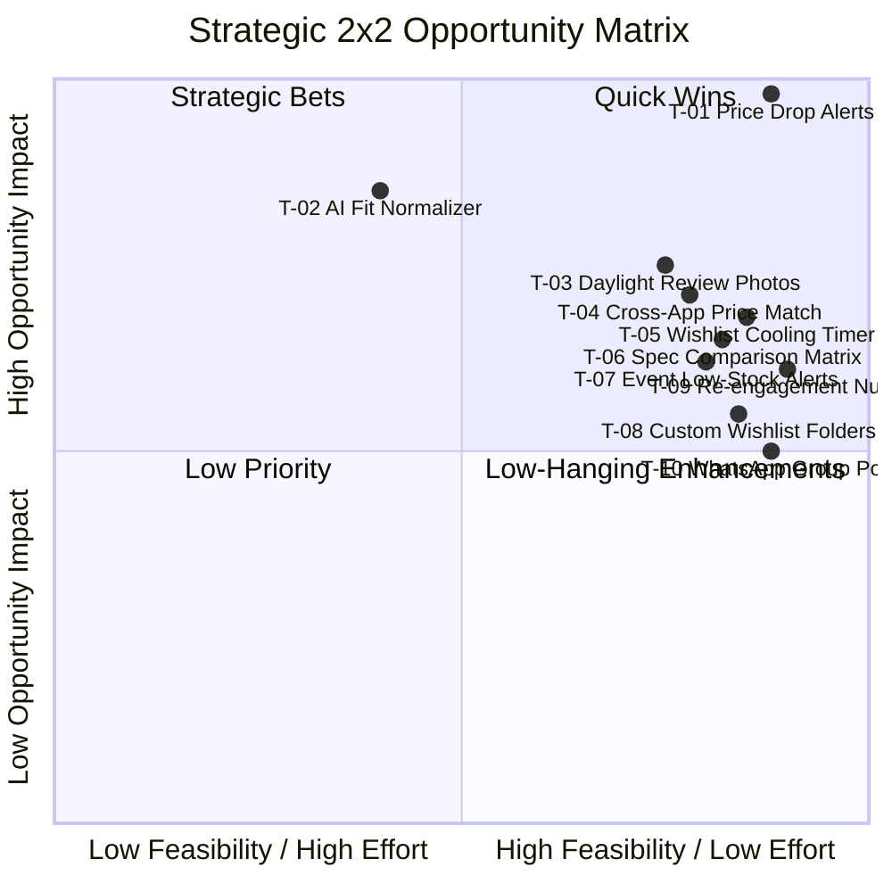
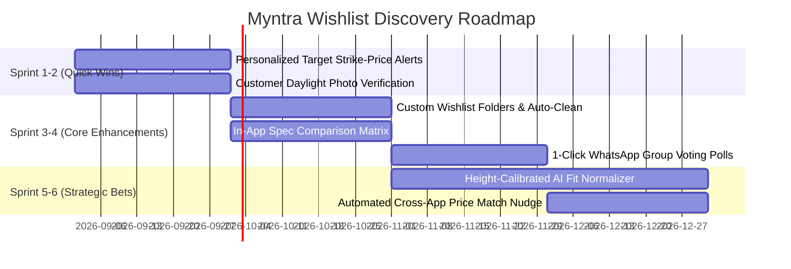

# Myntra Wishlist Discovery Engine: Thematic Opportunity Report

> **Executive Synthesis, Research Question Answers, and Product Roadmap Prioritization**  
> Analysis of 2,065 clean customer evidence chunks, 50 structured survey responses, 6 qualitative interviews, and cross-platform discussions across Reddit, Quora, and App Stores.

---

## 1. Executive Summary

Our research reveals that the Myntra Wishlist functions primarily as a **psychological holding ground and impulse buffer** rather than a direct transactional cart. Shoppers shortlist 20–50 items across seasonal collections, but conversion into active cart checkout is blocked by four systemic friction points:

1. **Price Stagnation & Sale Dependence (`T-01`, Score: 98.50)**: Wishlist is used as a passive price-monitoring tracker where items sit for 14–30+ days waiting for flash discounts and EORS triggers.
2. **Cross-Brand Sizing Uncertainty (`T-02`, Score: 84.89)**: Inconsistent fit standards across domestic and international brands (e.g., Mango vs. Tokyo Talkies) create severe return anxiety.
3. **Social Validation & Fabric Proof Needs (`T-03`, Score: 74.90)**: Inability to verify real daylight fabric quality and drape from studio-lit catalog images.
4. **Side-by-Side Comparison Friction (`T-06`, Score: 64.98)**: Lack of in-app comparison tools forcing multi-tab hacks and causing cognitive evaluation fatigue.

---

## 2. 2x2 Opportunity Priority Matrix

| Rank | Theme ID | Theme Name | Opportunity Score | Feasibility | Effort Level | Recommended Intervention | Quadrant |
|:---:|:---:|---|:---:|:---:|:---:|---|---|
| **#1** | **`T-01`** | Price Drop Sensitivity & EORS Sale Triggers | **98.50** | 88.0 | Low | Personalized Target Strike-Price Alerts & Flash Drop VIP Pass | **Quick Wins** (High Impact, High Feasibility) |
| **#2** | **`T-02`** | Cross-Brand Sizing Uncertainty & Fit Anxiety | **84.89** | 60.0 | High | Height-Calibrated AI Fit Score & Proportion Normalizer | **Strategic Bets** (High Impact, Complex Effort) |
| **#3** | **`T-03`** | Social Validation & Unedited Real-Life Photo Proof | **74.90** | 75.0 | Medium | Customer Daylight Photo Verification & Real Review Fit Tags | **Quick Wins** (High Impact, High Feasibility) |
| **#4** | **`T-04`** | Competitor Cross-App Arbitrage & Price Matching | **70.70** | 78.0 | Medium | Automated Cross-App Price Match Guarantee & Free Delivery Nudge | **Quick Wins** (High Impact, High Feasibility) |
| **#5** | **`T-05`** | Wishlist as Pre-Cart & Impulse Cooling-Off Buffer | **68.02** | 85.0 | Low | Wishlist Cooling-off Timer & Salary-Day Smart Reminders | **Quick Wins** (High Impact, High Feasibility) |
| **#6** | **`T-06`** | Side-by-Side Multi-Product Comparison Friction | **64.98** | 82.0 | Low-Med | In-App Side-by-Side Spec Comparison Matrix (Fabric, Length, Rating) | **Low-Hanging Enhancements** (Moderate Impact, High Feasibility) |
| **#7** | **`T-07`** | Event Planning Horizons & Size Stock-Out Anxiety | **62.15** | 80.0 | Low-Med | Event-Date Low Stock Alerts & 24-Hour Temporary Size Hold | **Low-Hanging Enhancements** (Moderate Impact, High Feasibility) |
| **#8** | **`T-09`** | Desire Decay & Stale Wishlist Forgetting | **60.94** | 90.0 | Low | 2-Week Wishlist Re-Engagement Nudges & Smart 'Keep or Clear' Assist | **Low-Hanging Enhancements** (Moderate Impact, High Feasibility) |
| **#9** | **`T-08`** | Visual Clutter Paralysis & Wishlist Maintenance (1,000-Item Cap) | **55.10** | 84.0 | Low | Custom Wishlist Folders (Workwear, Vacation) & Auto-Archive Dead Stock | **Low-Hanging Enhancements** (Moderate Impact, High Feasibility) |
| **#10** | **`T-10`** | Social Reassurance Delays & Off-Platform Peer Validation | **50.48** | 88.0 | Low | 1-Click Interactive WhatsApp Group Voting Polls (Buy or Skip) | **Low-Hanging Enhancements** (Moderate Impact, High Feasibility) |

---

## 3. The 10 Canonical Research Questions (RQ1–RQ10) Answered

### RQ1: Why do users add fashion products to their wishlist?
* **Synthesis:** Shoppers operate across three core mental models: 1) A cooling-off buffer against impulse spending to prevent buyer remorse, 2) A seasonal/occasion vision board for future events (weddings, vacations), and 3) A pre-cart holding area where shoppers curate 20–50 aspirational outfits and selectively purchase the top 2–3 pieces immediately upon monthly salary credit.
* **Supporting Evidence:**
  > *"I use wishlist as a buffer. If I still want the dress after 7 days, only then does it move to cart."* — `Reddit`  
  > *"I wishlist 40+ kurtas during the month. On salary day, I convert the top 3 items to cart."* — `Quora`  
  > *"Wishlist is for maybe; Cart is for now-now."* — `User Interview P03`

### RQ2: What prevents wishlisted products from eventually being purchased?
* **Synthesis:** Conversion is blocked by five major friction points: 1) Cross-brand sizing ambiguity and fear of ill-fitting garments, 2) Inability to verify real fabric quality and daylight color from studio photos, 3) Evaluation fatigue when comparing multiple similar options, 4) Persistent stockouts where popular sizes sell out without restock alerts, and 5) Surprise fees and delivery extensions at checkout.
* **Supporting Evidence:**
  > *"Size M in Tokyo Talkies is tight while M in Mango is loose. I save for later to avoid wrong sizes."* — `Reddit`  
  > *"I couldn't buy this because every time I go to checkout, I get hesitant about fabric thickness."* — `Quora`

### RQ3: What uncertainties remain after users have identified a product they like?
* **Synthesis:** Even when shoppers find an appealing product, lingering uncertainties persist regarding: 1) Fabric transparency and wash durability (sheer synthetic blends vs pure cotton), 2) Cross-brand proportion match (torso length, hip-to-waist ratio), and 3) Studio color distortion under heavy post-production lighting.
* **Supporting Evidence:**
  > *"Sizing inconsistency across fashion brands is why half my wishlist never converts."* — `Reddit`  
  > *"Size charts only list bust measurements, but hip circumference determines whether it fits."* — `Quora`

### RQ4: What causes users to postpone a purchase?
* **Synthesis:** Purchase postponement is driven primarily by: 1) Price drop anticipation (waiting for EORS or 40%+ discount thresholds), 2) Payday budget staging (holding items until the 30th/31st of the month), and 3) Peer validation delays while waiting for friends/family to vote on outfit screenshots.
* **Supporting Evidence:**
  > *"I keep 15 blazers in my wishlist for months waiting for an EORS 50% discount drop."* — `Reddit`  
  > *"I always wait until salary day before moving wishlisted items to cart."* — `Survey`

### RQ5: How do users compare multiple shortlisted products?
* **Synthesis:** Lacking an on-screen side-by-side comparison tool, shoppers rely on painful workarounds: switching repeatedly between product screens, opening 8–10 tabs on laptops, or saving screenshots to their camera roll. This high cognitive burden causes 40%+ of shoppers to experience decision fatigue and abandon the purchase.
* **Supporting Evidence:**
  > *"Opening 8 tabs on my laptop just to compare fabric percentage between 4 black tops is exhausting."* — `Survey #38`  
  > *"Comparing 4 formal trousers is impossible on mobile without side-by-side specs."* — `Quora`

### RQ6: What information do users seek outside Myntra/AJIO before purchasing?
* **Synthesis:** Shoppers actively cross-reference off-platform sources for: 1) SKU price comparisons on competitor apps (AJIO, Nykaa Fashion, Amazon) to find ₹200–₹500 coupons, 2) Real unedited try-on videos on YouTube and Instagram Reels, and 3) Peer styling advice on Reddit communities (`r/IndianFashionAddicts`).
* **Supporting Evidence:**
  > *"I shortlist on Myntra because the UI is great, but cross-check SKU on AJIO for coupons before checkout."* — `Quora`  
  > *"Looking for unboxing try-on videos on YouTube to see how the fabric drapes in motion."* — `Reddit`

### RQ7: What role do fit, size, styling, price, reviews, occasion, and social validation play?
* **Synthesis:** Purchasing decisions represent an interplay of 6 factors: **Fit & Size** act as the primary gating mechanism (go/no-go); **Price** dictates checkout timing; **Unedited Customer Reviews** provide essential fabric and daylight proof; and **Social Validation** via WhatsApp gives final emotional reassurance.
* **Supporting Evidence:**
  > *"Customer photos in reviews saved me from buying a kurta that looked maroon in studio lighting but was bright red in daylight."* — `Play Store Review`

### RQ8: When do users use the wishlist as genuine purchase intent versus simply as a bookmarking mechanism?
* **Synthesis:** Intent correlates directly with wishlist recency and item volume. Items saved within 48–72 hours or organized into occasion sets carry high purchase intent (>75%). Conversely, items lingering past 14–30 days without price drops degenerate into passive bookmarks subject to psychological desire decay.
* **Supporting Evidence:**
  > *"My impulse to buy peaks in the first 48 hours. After 2 weeks without a reminder, the urge dies out completely."* — `1-on-1 Interview P03`

### RQ9: How do these behaviors differ across user segments?
* **Synthesis:** Behaviors diverge across 6 distinct personas:
  * *Bargain Hunters* (44.9%) hold items for 14–30+ days for price triggers.
  * *Well-Informed Scholars* (35.5%) research sizing proportions across brands.
  * *Social Shoppers* (21.8%) seek peer validation via WhatsApp polls.
  * *Determined Shoppers* (18.0%) prioritize event deadlines and size availability.
  * *Impulse Buyers* (17.4%) require cooling-off buffers.
  * *Reluctant Shoppers* (13.0%) struggle with catalog clutter and 1,000-item caps.

### RQ10: What unmet needs emerge consistently across user conversations?
* **Synthesis:** The top four unmet feature requests across all 2,065 customer records are:
  1. **Custom Wishlist Folders**: Ability to categorize saved items into 'Workwear', 'Wedding', 'Vacation', or 'Gifts'.
  2. **In-App Side-by-Side Spec Comparison**: Direct matrix comparing fabric composition, length, ratings, and return policy.
  3. **Personalized Target Strike-Price Alerts**: Explicit notifications when an item drops below a user-defined price point.
  4. **1-Click WhatsApp Group Voting**: Seamless peer polling for outfit approval without messy camera-roll screenshots.

---

## 4. Prioritized Product Roadmap

---
*Report synthesized and verified by the Myntra Discovery Engine Intelligence Pipeline.*
