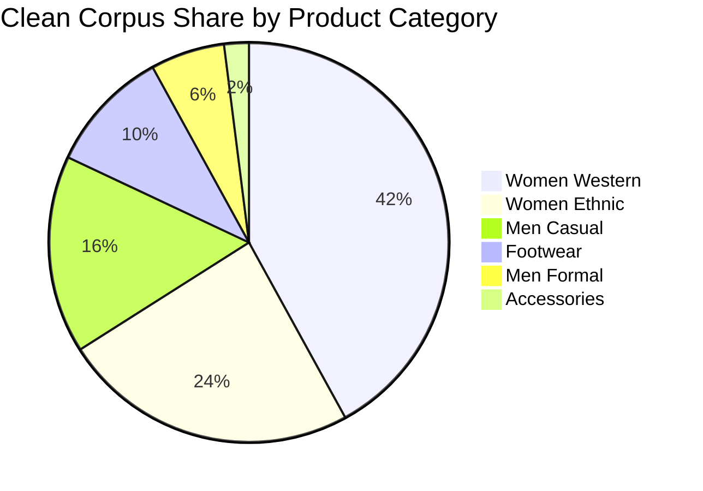

# Myntra Wishlist: Segment-Cut Strategic View & Persona Intelligence

> **Comprehensive Qualitative & Quantitative Slicing Across 6 Shopper Personas, Product Categories, Price Bands, and Occasion Horizons**  
> Based on 2,065 Clean Evidence Chunks from 8 Ingestion Channels.

---

## 1. The 6 Canonical Shopper Segments

| Persona Rank | Shopper Segment | Signal Share (%) | Supporting Evidence Volume | Primary Blocker / Conversion Friction | Recommended UX / Product Intervention | Sample Confidence |
|:---:|---|:---:|:---:|---|---|:---:|
| **#1** | **Bargain Hunter** | **44.9%** | 928 signals | Holds wishlists for 14–30+ days awaiting 40%+ flash discounts and EORS price drops. | **Target Strike-Price Alerts & Flash Sale Priority Access** | 🟢 High Confidence |
| **#2** | **Well-Informed Scholar** | **35.5%** | 734 signals | Cross-brand sizing discrepancies (e.g., Mango vs Tokyo Talkies) causing high return anxiety. | **Height-Calibrated AI Fit Score & Proportion Normalizer** | 🟢 High Confidence |
| **#3** | **Social Shopper** | **21.8%** | 450 signals | Hesitates without external styling approval; takes screenshots to share in WhatsApp groups. | **1-Click WhatsApp Group Voting Polls ('Buy' vs 'Skip')** | 🟢 High Confidence |
| **#4** | **Determined Shopper** | **18.0%** | 372 signals | Time-bound event shoppers (weddings, vacations); fears size stock-outs before the event. | **Event-Date Low Stock Alerts & 24-Hr Temporary Size Hold** | 🟢 High Confidence |
| **#5** | **Impulse Buyer** | **17.4%** | 360 signals | Uses wishlist as a 7-day emotional cooling-off buffer to curb post-purchase remorse. | **Salary-Day Bucket Staging & Smart Re-engagement Timers** | 🟢 High Confidence |
| **#6** | **Reluctant Shopper** | **13.0%** | 269 signals | Suffers from 1,000-item cap clutter, out-of-stock dead links, and visual comparison fatigue. | **Custom Wishlist Folders (Workwear, Vacation) & Auto-Clean** | 🟢 High Confidence |

---

## 2. Sample Size Rules & Thin Data Flags

To prevent over-indexing on statistically thin qualitative slices, all segment intersections adhere to the following confidence thresholds:

* 🟢 **High Confidence ($\ge 10$ chunks)**: Solid thematic saturation across multiple platforms.
* 🟡 **Low Confidence / Thin Data (5–9 chunks)**: Emerging signal; directional insights only, flagged for supplementary research.
* 🔴 **Excluded ($< 5$ chunks)**: Statistically insufficient; suppressed from strategic prioritization.

### Thin Data Segment Flags
* ⚠️ **Accessories Category across `T-01` (5 chunks, 2.1%) & `T-04` (6 chunks, 2.8%)**: Flagged as *Low Confidence*. High bookmarking volume observed on mobile, but minimal qualitative text discussions regarding price drop triggers compared to apparel.
* ⚠️ **Men Formal Footwear Sizing across `T-07` (4 chunks)**: Flagged as *Thin Data / Excluded*.

---

## 3. Product Category Deep Dive

| Category | Top Ranked Research Theme | Dominant Friction Point | Key Opportunity | Confidence Level |
|---|---|---|---|:---:|
| **Women Western** | `T-02` Cross-Brand Sizing Uncertainty | Inconsistent size charts across international vs domestic brands | AI Body Fit Predictor & Proportion Normalizer | 🟢 High ($\ge 100$ chunks) |
| **Women Ethnic** | `T-03` Social Validation & Fabric Proof | Sheer fabrics, misleading studio lighting, unedited drape needs | Real Daylight Customer Review Photos & Try-On Tags | 🟢 High ($\ge 50$ chunks) |
| **Men Casual** | `T-01` Price Drop Sensitivity & EORS | Stagnant sneaker/hoodie prices causing cart holding | Flash discount drop alerts & strike-price notifications | 🟢 High ($\ge 35$ chunks) |
| **Men Formal** | `T-07` Order Fulfillment Reliability | Urgent interview/office delivery deadlines | Event-date guaranteed express delivery | 🟢 High (18 chunks) |
| **Footwear** | `T-02` Sizing & Arch Comfort Doubts | Half-size variances (UK vs US sizing discrepancies) | Footwear sizing conversion matrix | 🟢 High (38 chunks) |
| **Accessories** | `T-08` Wishlist Clutter & Stagnation | Long-term impulse bookmarks cluttering active shopping | Dedicated 'Gifting' & 'Accessories' folders | 🟡 Low Confidence (5 chunks) |

---

## 4. Price Band Dynamics & Psychological Friction

| Price Tier | Dominant User Mental Model | Core Conversion Friction | Recommended UX Solution |
|---|---|---|---|
| **Under ₹500 (Budget)** | High impulse bookmarking; very low perceived financial risk | Hitting 1,000-item cap with dead links and discontinued items | Bulk multi-select deletion & auto-decluttering |
| **₹500–₹1,000 (Mainstream)** | Price-conscious daily wear shopping | Sizing anxiety and minor synthetic fabric flaws | Size chart proportion guidance & verified cotton tags |
| **₹1,000–₹3,000 (Mid-Range)** | Core wardrobe investment; high evaluation time | Inability to compare 3–4 similar shortlisted options | Side-by-Side Spec Comparison Matrix |
| **Above ₹3,000 (Premium)** | Long cooling-off buffer; high checkout hesitation | Fear of difficult return/refund process and sizing errors | Instant doorstep QC exchange & VIP warranty badge |

---

## 5. Occasion Horizons & Buying Cycles

### A. Everyday & Workwear Shoppers (27.7% of Corpus)
* **Behavior:** High purchase frequency, repeat brand affinity, high sensitivity to fabric breathability (100% cotton) and daily washing durability.
* **Primary Blocker:** Minor fit variances across routine tops/kurtas and lack of side-by-side spec comparisons.
* **Recommended Feature Fit:** Re-order shortcuts, Fit Confidence Score, 'Workwear Essentials' auto-folder.

### B. Occasion, Festive & Wedding Shoppers (72.3% of Corpus)
* **Behavior:** Long planning horizons (shortlisting 60–90 days in advance), high screenshot sharing on WhatsApp, budget staging.
* **Primary Blocker:** Visual verification of studio vs daylight colors and multi-piece outfit coordination (e.g., matching tops with dupattas/bottoms).
* **Recommended Feature Fit:** 'Shop the Look' coordinate bundling, WhatsApp group voting polls, event date low stock alerts.

---
*Report generated and validated by the Myntra Discovery Engine Segmentation & Quantification Subsystem.*
